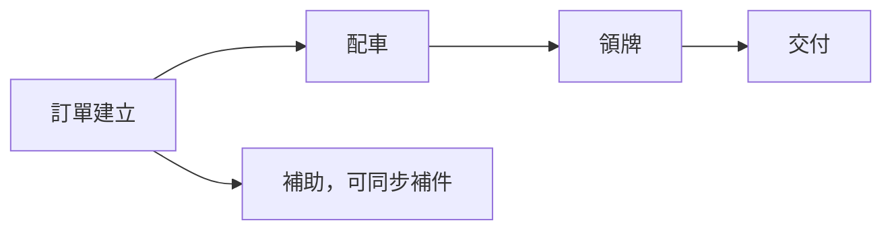

# 車輛銷售管理系統｜使用者操作手冊

## 報表視覺化設計（2026-09-10）

報表中心直接提供左側選頁與右側閱讀，依「銷售統計／大數據分析／自訂報表」及既有頁序排列。左側反白為目前頁面；同一登入工作階段回到報表中心時會開啟上次查看頁面，若該頁取消發布或已無權限，改開第一張可讀報表。切換頁面不沿用上一頁篩選。手機點「報表頁面」展開清單；完整資料說明可展開「資料口徑與說明」。

點選圖表分類會直接連動同頁其他圖表與資料表，不會自動擠出訂單明細。再點同一分類取消；勾選「複選分類」或按住 Ctrl／⌘ 點擊可增加或移除分類。同一圖的多選代表「任一符合」，不同圖的選取則需同時符合。每圖最多 200 個分類，整組選取仍受網址查詢長度上限保護。

「總車輛銷售」不需要勾選複選模式：桌機按 Ctrl／⌘ 點選、觸控裝置直接連點即可增減分類。連續點選立即標示，停止點選約 0.3 秒後合併更新，不必等上一個分類更新完。更新失敗會保留上次成功結果並提供重試。滑鼠指向或鍵盤聚焦圖形可直接查看分類、台數及占比；點圖形即同步其他圖表與下方來源明細，不需展開數字。選取中的圖表保留候選分類供改選，提示會明確區分候選範圍與完整篩選範圍。

總車輛銷售與電動車銷售統計的銷售來源、領牌年月複選欄會自動套用；全選代表不限，全部取消代表無資料。日期等手動輸入仍可用「套用篩選」。「清除我的篩選」會清除個人查看條件，但不解除報表固定條件。

選取中的圖會保留候選分類供改選，因此它的「候選分類範圍」可能大於其他圖；來源訂單及 CSV 仍依完整選取。動態合併的「其他」暫時使用來源明細，不作交叉篩選。按「查看來源訂單」才開啟浮動明細，不縮小圖表；可按 Escape 關閉。排序與日期層級位於「圖表設定」。正式閱讀以設計高度作最低高度，內容較多時自動延伸，避免卡片內捲動截斷圖形。

套用篩選與圖表點選會在頁內更新，瀏覽器上一頁可返回先前條件。更新失敗或逾時保留上次成功畫面，可按「重試更新」；資料版本已更動時請重新整理。總車輛銷售已改用 Chrome 核對可見原圖；跨來源筆數仍須另外核對，不代表數字已逐筆相符。

admin 由「資料維護區 → 管理者工具 → 報表設計管理」編輯。一般查看使用「報表中心」；既有報表查看權限不因新版設計器而改變。

「總車輛銷售」使用銷售總覽版型：主要條件為銷售來源、領牌年月；左右並排堆疊座標圖與占比圖，指向圖形即可查看數字。共用分類說明收在頁首「資料口徑與說明」，不影響固定條件。管理者可選擇一般、銷售總覽或電動車銷售閱讀版型，其他報表不會因此一起變動。

1. 桌面預設進入「專注設計」，保留主要導覽與儲存列；再按一次可返回一般版面，設定整份報表名稱、固定範圍、附表或版本還原。左側頁面／圖表與右側設定均可收合。切換報表前請儲存，有未儲存變更會提醒。
2. 中央是整份正式報表的實際渲染，不再把每張圖縮進不同預覽框。「內容寬度」指報表本體、不含頁面導覽，提供 1440／1180／820／390 px。「符合寬度／整頁／100%」只等比例縮放預覽，不會改變儲存的圖表尺寸。要看實際字級請選 100%，需要時在畫布內捲動。
3. 「編輯版面」點選圖表，在右側的資料／樣式／版面／互動分頁設定。資料：分類、指標、排序、顯示群數及固定條件；樣式：名稱、圖形種類、字級、標題對齊、配色與圖例；版面：半寬／全寬與最小高度；互動：滑入提示及圖形連動。每個欄位提供用途及範例，不適用的欄位不顯示。
   「樣式 → 呈現方式」點開圖像選擇器，以雙欄縮圖比較長條圖、折線圖、圓環占比圖、資料表、指標卡及堆疊長條圖。每種附用途說明，已選項目有勾號與外框；縮圖是範例資料。可用方向鍵移動、Enter／Space 選取，Escape 或關閉取消。選取後自動更新預覽，仍須儲存／發布才會保留；重新選同一項或取消不會變更設定。
4. 拖曳圖表選取框左上把手到另一張圖可排序；拖曳右下角可調整寬高。也可使用右側上移、下移與尺寸欄位；尺寸把手支援方向鍵。高度是最小高度，內容較多自然延伸，不裁切圖形。每份最多 8 張圖，目前維持半寬／全寬網格，不是任意重疊的自由座標畫布。
5. 設定停止輸入後約 0.65 秒自動更新整頁預覽，也可按「更新預覽」。錯誤或逾時保留表單輸入及上次成功畫面，狀態列會說明尚未更新。變更設定重新查詢時會清除本次試選條件。
6. 「互動預覽」或「預覽本次設計」可試用滑入彩色提示、點圖連動、Ctrl／⌘ 複選、篩選、排序、來源明細與 CSV／Excel 相容 CSV。預覽僅讀取資料，不新增版本、不發布、不改動訂單；要開啟原訂單請改用已發布報表。回到編輯模式即可調整版面，避免拖曳與選取資料互相干擾。
7. 按「儲存並發布」一次保存並更新報表中心；只想暫存可用「儲存草稿」。還原只更新草稿，核對後須再次發布。相同設定、資料、篩選及報表內容寬度，設計預覽與正式版使用相同呈現；舊的已發布版本不會因修改草稿而立即改變。

指定 13 張報表已依指示發布；原 Google 資料差異的核對紀錄仍保留，不因發布而視為差異已全部消除。

版本：1.1

最後更新：2026-09-04

適用對象：業務、行政、庫存、財務與內部管理人員

> 這是給實際使用者看的手冊，不需要懂程式。登入系統後，也可以按右上角「使用說明」搜尋同樣內容並列印。

---

## 目錄

1. [三分鐘快速開始](#一三分鐘快速開始)
2. [戰情首頁與全欄位搜尋](#二戰情首頁與全欄位搜尋)
3. [建立訂單與草稿](#三建立訂單與草稿)
4. [證件拍照與自動辨識](#四證件拍照與自動辨識)
5. [列印與簽署文件](#五列印與簽署文件)
6. [訂單建立後怎麼做](#六訂單建立後怎麼做)
7. [配車](#七配車)
8. [汰舊與補助](#八汰舊與補助)
9. [領牌](#九領牌)
10. [交付](#十交付)
11. [取消與退款](#十一取消與退款)
12. [庫存與快速進車](#十二庫存與快速進車)
13. [資料維護](#十三資料維護)
14. [價格表分發](#十四價格表分發)
15. [營運、淨利與對帳](#十五營運淨利與對帳)
16. [歷史 Excel 匯入](#十六歷史-excel-匯入)
17. [列印套表](#十七列印套表)
18. [常見狀況排除](#十八常見狀況排除)
19. [個資與帳號安全](#十九個資與帳號安全)
20. [系統狀態與完整性報告](#二十系統狀態與完整性報告)
21. [白話名詞表](#二十一白話名詞表)

---

## 一、三分鐘快速開始

### 先記住四件事

1. **每天先看戰情首頁**：優先處理、待配車、進行中與庫存都在這裡。
2. **想找什麼就直接搜尋**：不用先選姓名、電話或車牌欄位。
3. **訂單建立時不配實體車**：訂單成立後，內部人員才到「配車」選引擎／車身號碼。
4. **看不到資料先搜尋，不要重複建立**：避免同一位客人有兩張內容相同的訂單。

### 系統入口圖

```text
電腦上方：戰情首頁｜全部訂單｜營運總表｜資料維護｜使用說明｜檢查更新｜登出

手機下方：   首頁   訂單   ＋新增   營運   更多
```

手機按「更多」後會先顯示「快速前往」。每個帳號可按「自訂捷徑」設定 1～6 個常用
功能並調整位置；設定跟著帳號保存，不會影響其他使用者。留白位置會自動略過。未設定
時預設包含價格表分發、合作車行、車輛庫存、機種與售價、客戶查詢及網路平台；其餘
功能由「查看全部功能」進入資料維護區。

### 手機加到主畫面後看不到新版

1. 先確認草稿已顯示最新保存時間；正式訂單修改請先按「儲存修改」。
2. 按上方「檢查更新」。
3. 系統提示有新版時，按「重新載入」。

### 登入時要注意

- 帳號或密碼連續錯誤 5 次，系統會暫停該裝置繼續嘗試 15 分鐘，避免帳號遭猜測。
- 不要共用密碼，也不要把密碼寫在瀏覽器可被他人看到的位置。
- 系統以一個工作日為使用週期；長時間未操作後若回到登入頁，重新登入即可，草稿仍以畫面顯示的最後保存時間為準。

### 一張訂單會交給誰


每次接手先看訂單上方的狀態、尚缺項目與處理紀錄；完成自己的工作後，確認畫面已顯示最新人員與時間。不要用 LINE 訊息代替系統紀錄。

### 從 Excel 切換時的三個原則

1. **同一筆資料只決定一個正式來源**：切換日期由管理者公告；不要有人改 Excel、另一人改系統，最後再猜哪份正確。
2. **新訂單先在系統找過再建立**：姓名、電話、證號、車牌或識別號碼至少搜尋一項。
3. **平行期只拿 Excel 核對，不重複手抄**：若發現差異，留下訂單編號與欄位，交由管理者判斷，不自行覆蓋歷史資料。

---

## 二、戰情首頁與全欄位搜尋

### 首頁數字怎麼看

| 區塊 | 意思 |
|---|---|
| 需要優先處理 | 逾期或重大待辦，例如車行交付後缺文件、缺尾款 |
| 待配車 | 訂單已成立，但還沒指定實體車 |
| 進行中 | 已配車，尚未全部交付完成 |
| 可售庫存 | 尚未被訂單保留、可以配出的實體車 |
| 本月成果 | 以實際領牌日期認列，不是訂單建立月份 |

### 像 Excel 一樣搜尋

不必先說要搜哪個欄位，輸入你記得的任何內容：

- `0912`：電話片段。
- `ABC1234` 或 `ABC-1234`：車牌。
- `王小明`：車主姓名。
- `SUI 125`：車型。
- `手機架`：配件。
- 備註、文件名稱、引擎／車身號碼也可以。

搜尋結果會顯示「哪個欄位、哪一段內容」符合。證件號碼在畫面上仍會遮蔽。

### 搜尋不到時

1. 改輸入部分內容，不一定要完整。
2. 移除空格、連字號再試一次。
3. 「最近訂單」只是最新動態；全部資料請進「全部訂單」。

---

## 三、建立訂單與草稿

建立訂單有五個區塊：


### 1. 來源與交易類型

- **本店**：來源名稱可留空；若要知道由哪位員工承辦，可選擇員工姓名。
- **合作車行／網路平台**：必須選正確名稱。
- **交易類型**：另選一般新車、領牌車、試乘車、中獎車、中古車交易或其他。這和通路名稱是兩件事。
- 找不到來源名稱時，不要亂選；可到「資料維護區」的「合作車行」、「網路平台」或
  「本店人員」維護。系統分類則在「通路類別」調整。歷史 Excel 匯入時也能在原畫面
  直接新增分類與來源。

例：Excel 寫「昌勝（試乘車）」時，系統會拆成來源「昌勝」與交易類型「試乘車」，不會把「試乘車」誤建成一家車行。

### 2. 車主與證件

- 本國自然人：身分證正反面。
- 外籍／居留者：居留證正反面。
- 法人：人員自行填公司名稱、統編、地址與聯絡資料。
- 系統自動辨識後仍要人工逐欄核對。

外籍／居留者目前不需要登記護照資料。法人新車領牌請先準備：

1. 營利事業登記證、公司變更登記表或商業登記抄本影本（擇一）。
2. 政府公文准予登記函或經濟部准予登記函影本（擇一）。
3. 近一期 401 報表影本。
4. 公司大小章。
5. 公司存摺（申請補助時）。

若目前畫面沒有專屬文件名稱，請放到對應工作的「其他文件」，並以「公司名稱－文件名稱」命名，避免領牌時找錯。

### 3. 車輛

- 選品牌車型、車輛年份與車色。
- 此時不選引擎／車身號碼。
- 車型或車色找不到時，先請有權限的人新增或啟用主檔。

### 4. 金額

- 主要付款方式：現金、分期、刷卡。
- 選分期後才會顯示分期公司、期數、開辦費與每期金額。
- 其他費用不是必填，需要時再按新增。
- 金額欄位沒有內容就保持空白，不要為了送出任意填 `0`。

### 5. 其他需求

- 選號方式、交車方式必填。
- 指定地點或委託託運，必須填送達位置。
- 配件可新增多筆，也可刪除。
- 配件選「加購」會計入應收；選「贈送」不計入客人應收。
- 汰舊／補助在訂單只決定是否申請與新舊車主是否同人，詳細資料到後續「補助」處理。
- LicenseWatcher 尚未啟用，指定號碼目前仍由人員依提醒處理。

### 例子：一般現金訂單

> 陳小華到本店買 SUZUKI SUI 125／2026／白色，現金付款、不申請補助、來店取車。

1. 來源選「本店」。
2. 拍身分證正反面並核對姓名、生日、證號、地址。
3. 選 SUZUKI SUI 125、2026、白色。
4. 付款選現金，牌險依單據收取。
5. 選號選無、交車選客人來店取車。
6. 按「建立訂單」。

### 草稿與正式修改差異

| 狀況 | 保存方式 |
|---|---|
| 正在新增訂單 | 自動保存草稿，畫面會顯示時間 |
| 重新開啟草稿 | 繼續自動保存 |
| 已建立訂單後修改 | 必須填變更原因並按「儲存修改」 |
| 不想保留修改 | 按「取消修改」 |
| 刪除草稿 | 草稿與草稿照片一起刪除，無法復原 |

如果顯示其他人正在編輯，只能查看；不要重複建單。對方異常關閉後，約 90 秒鎖定才會失效。

---

## 四、證件拍照與自動辨識

### 正確操作

1. 選「拍照」或「上傳圖片」。
2. 避免反光、模糊、裁切或角度過斜。
3. 看到「正在辨識」後，可先填其他區塊，不必停著等待。
4. 完成後回到車主區，對照照片逐欄確認。
5. 有錯直接人工修正，再勾人工核對。

### 圖片與欄位怎麼對照

```text
┌──────────────┐       ┌──────────────────┐
│ 證件正面照片 │  對照 │ 姓名、生日、證號 │
│ 查看/更換/移除│       │ 逐字人工確認     │
└──────────────┘       └──────────────────┘

┌──────────────┐       ┌──────────────────┐
│ 證件反面照片 │  對照 │ 戶籍／居留地址   │
│ 查看/更換/移除│       │ 留意巷弄樓房     │
└──────────────┘       └──────────────────┘
```

### 常見辨識錯誤

- 姓名少一個字：看正面照片補齊。
- `10樓` 變成 `1樓`：放大反面逐字確認。
- 正反面放錯：按移除後重新上傳。
- 居留證把「就學」當姓名：依照片改回正確中文姓名。
- 辨識失敗：重新拍攝，或人工輸入後核對。

> OCR 是協助輸入，不是最終正確答案。訂單、領牌與補助仍以人工核對為準。

---

## 五、列印與簽署文件

建立訂單後可一次列印三頁：

1. 客戶留存訂購單。
2. 店家留存訂購單。
3. 個人資料使用同意書。

### 手機列印

1. 按「一鍵列印全部文件」。
2. 系統開啟 PDF。
3. 從手機選擇可用印表機，或分享至可列印的電腦。

### 簽署後

- 回到訂單的「訂單資料」，在「簽署文件留存」上傳訂購合約與個資同意書。
- 訂購合約與個資同意書分開拍照／上傳，方便日後單獨查閱。
- 目前文件未上傳不會阻擋配車，但仍應依內部作業補齊。
- 版面偏移請調整套表或印表機偏移，不要改訂單資料。

### 證件影本一定要加用途浮水印

1. 到訂單的「訂單資料」頁籤，在車主資料展開「列印／下載浮水印證件」。
2. 每次選擇「限領牌使用」或「限申請補助使用」。
3. 勾選這次要正面、反面或兩面。
4. 按「產生浮水印 PDF」後再列印或下載。

PDF 會顯示用途與當天日期，系統不會改動原始證件照片，並會留下產生人員與時間紀錄。

---

## 六、訂單建立後怎麼做

上方是工作頁籤，不是硬性關卡：



- 補助可以在還沒配車時先作業。
- 簽署文件不是獨立階段，在「訂單資料」內可隨時補上。
- 領牌必須先配車。
- 一般客戶一定要完成領牌才可交付。

進入訂單後，先看頁籤下方的「建議下一步」。系統只會突出一項最需要處理的工作，並列出最多兩項可同步工作；人在其他頁籤時可按按鈕直接前往，已經位於建議頁籤時則會標示「目前作業」並隱藏重複的前往按鈕。系統不會自動替你配車、完成領牌或送出資料。

### 建議下一步怎麼用

- **主要建議**：目前最接近完成流程、期限最急，或會阻擋後續的工作。
- **可同步處理**：例如補助、合作車行先領車與補上簽署文件，不會變成硬性關卡。
- **稍後處理**：按下後縮成一列，工作不會被刪除；按「查看」即可重新展開。
- **狀態更新**：完成配車、領牌、交付或退款後，系統會依新狀態自動換成下一項建議。

例子：訂單沒有符合庫存時，系統會建議「前往快速進車」；合作車行先領車後，則會提醒三個工作日內補領牌資料，以及七個工作日內確認款項。

---

## 七、配車

1. 進入訂單的「配車」。
2. 清單只顯示相同車型、年份、車色且可售的車。
3. 核對引擎／車身號碼與目前實際位置。
4. 按「確認配車並鎖定」。

### 沒有可選車

- 檢查是否已完成進車。
- 檢查車型、年份與車色是否完全一致。
- 檢查車是否已被其他訂單保留。

### 更換配車

- 更換時必須填原因。
- 已有車牌、領牌完成紀錄或任何領牌文件時，不能直接更換；先由行政處理領牌資料。
- 配車代表保留車，不代表車已實際調到交車地點；實際移動仍要更新庫存位置。

---

## 八、汰舊與補助

1. 在訂單勾選申請汰舊／政府補助。
2. 到「補助」填舊車車牌、補助類型與舊車資料。
3. 新增工業局、環境部、地方政府或其他補助項目。
4. 每一項填預計金額、申請日期與狀態。
5. 上傳固定文件；額外資料放在可新增的「其他補助文件」。

### 新舊車主不同

還需要：

- 舊車主姓名與身分證字號。
- 舊車主身分證正反面。
- 舊車主存摺。
- 新舊車主不同人聲明書。

存摺除了照片，仍需填銀行名稱、分行與帳號。

### 注意

- 汰舊與中古車回收估價不是同一件事，也不強制二選一。
- 其他補助文件不列入固定文件齊全條件。
- 關閉補助不會自動刪除已上傳文件。
- 已取消訂單不能再修改補助。

---

## 九、領牌

### 步驟

1. 確認已完成配車。
2. 填實際領牌日期、領牌縣市與車牌號碼。
3. 上傳新行照、新車領牌登記書與發票。
4. 有選號時上傳選號單。
5. 其他保險單可新增多份。
6. 尚缺項目歸零後，按「確認領牌完成」。

### 系統會自動做的事

- 依實際領牌日期與領牌縣市帶入代銷結算成本。
- 依實際領牌日期帶入獎勵與補助版本。
- 油車依級距先試算牌險。

### 例外

- 找不到成本規則：先到車型資料補建適用版本，不要填 `0`。
- 牌險試算與單據不同：以正式單據修正，並在首頁確認差額。
- 電動車／微型電動二輪車公式尚未完整時，以正式單據人工輸入。
- 完成領牌後，文件與配車會鎖定，不能任意修改。

---

## 十、交付

### 一般客戶

必須先完成領牌。

### 合作車行

可以先交車，再補領牌與收款：

- 實際交車後 3 個工作日內補領牌文件。
- 實際交車後 7 個工作日內補尾款。
- 工作日排除週六、週日與系統設定國定假日；國定假日每月會由人事行政總處自動同步。

### 交付必填

- 交付方式、時間。
- 收車人、電話。
- 實際交付地點。
- 交付車況：直接點選「正常」、「發現刮傷或損壞」或「其他狀況」。
- 車況、文件、鑰匙、配件贈品與收款五項核對。

特殊情形、既有痕跡或客戶交代可寫在「交付備註」。選擇「發現刮傷或損壞」時必須填寫刮傷／損壞說明；選擇「其他狀況」時必須填寫交付備註。

託運時，交付時間是交給託運公司的時間，並需填託運公司與目的地。確認資料後，使用表單最下方的「確認完成交付」；完成後訂單與實體車輛會鎖定。

---

## 十一、取消與退款

只有**尚未領牌、尚未交付**的訂單可以取消。

1. 在訂單資料底部的「訂單取消與退款」卡片，按「展開取消流程」。卡片預設收合，也可用 Tab 選取後按 Enter 或空白鍵展開；展開本身不會取消訂單。
2. 填取消原因與說明。
3. 系統解除配車，車輛恢復可售。
4. 有收訂金時，登記全額退款。
5. 保存退款金額、日期、方式、交易資訊與證明。
6. 退款完成才算取消完成。

退款金額必須等於訂金，不能少退或用分次退款結案。未收訂金的訂單會直接完成取消。

---

## 十二、庫存與快速進車

### 庫存清單

- 搜尋識別號碼、機種、車色、合作車行或車況。
- 篩選狀態、機種、車色、實際位置；同一機種的不同年式會整理在同一個選項。
- 依日期、車型、車色、識別號碼、狀態或位置排序。
- 實際位置未選合作車行時顯示「本店」；調到合作車行後直接顯示車行名稱。
- 車況異常會以紅色醒目標示；只有一般說明時顯示「有備註」，避免與異常車輛混淆。

### 快速進車

1. 每一列填一台車。
2. 車型與車色用下拉選擇。
3. 油車填引擎號碼；電動／微型電動車填車身號碼。
4. 填出廠年月；進車日期預設今天。
5. 車況說明選填。
6. 整批確認後建立。

任一列重複、缺資料或車色不屬於車型時，整批不建立。依畫面指出的列修正後再送出，避免只進一半。

### 調車與車況

- 變更「本店／合作車行」實際位置會自動產生調車歷程，並保留當時顯示的地點名稱。
- 車況文字、照片與處理結果會保留當時資料。
- 配車後核心欄位會鎖定；交付完成後只能依規則補充車況。
- 出廠年月用於先進先出，不要只看車型年份。

---

## 十三、資料維護

### 客戶資料

- 從訂單自動彙整。
- 同證件號碼會整理成同一位客戶，能查看所有歷史訂單。
- 客戶資料要修改時，回原訂單修改並留下變更原因。

### 車型資料與生效版本

「機種與售價」以「啟用中／已停用」頁籤分開顯示。停用只是不讓新資料再選用，歷史
訂單仍保留；需要恢復時到已停用頁籤編輯，不要重建同一機種。

| 資料 | 依據日期 |
|---|---|
| 售價 | 訂單日期 |
| 分期方案 | 訂單日期 |
| 代銷結算成本 | 實際領牌日期＋領牌縣市 |
| 實銷獎勵、促銷補助、分期補貼息 | 實際領牌日期 |
| 車行傭金／台數獎金 | 規則指定的日期與條件 |

例：8/15 起成本從 65,000 調為 66,000，應新增「8/15 生效」版本，不修改 7/1 舊版本。8/14 已領牌訂單仍保留 65,000。

### 其他共用資料

- 配件：售價、工資與參考成本。
- 車行獎勵品項：集中維護實物、紅包／現金、禮券／兌換券、旅遊點數的名稱、單位與
  成本生效版本。品項和車型只建一次；實際要給哪些獎勵，再到「車行傭金與銷售獎勵」
  依車型與期間設定。
- 車行傭金與銷售獎勵：同一頁先看各車型，再進入設定「每台現金傭金」與「非傭金的
  附加獎勵」。附加獎勵可同時選多個品項，並保存當時的單位成本快照；它不會混入現金
  傭金金額，也不會自動建立庫存出庫、應付款或單筆淨利支出。
- 通路類別：決定來源在系統中的處理方式；合作車行、網路平台與本店人員各自有獨立
  維護清單。只有處理方式為「合作車行」者套用車行傭金。
- 合作車行：「啟用中／已停用」分頁保存歷史資料；可維護聯絡電話、地址、Google Maps
  導航、品牌合作、三陽專銷、傭金加減與年節送禮名單。沒有被訂單、庫存、台數獎金或
  匯入對應使用的車行才可刪除；已有歷史關聯時請停用。
- 網路平台／本店人員：平台維護來源代碼與聯絡方式；本店人員維護姓名、所在店、電話
  與每筆傭金。
- 分期公司：名稱、客服電話。維護車型分期方案時，也能在公司欄位旁直接新增；建立後，目前列與之後新增的期數都能立即選到。
- 分期方案的預估撥款有三種：常態比例選「按比例試算」、每張都相同選「固定金額」、少數特殊案件選「本單另填」。刪除尚未填完的期數列後，該列不會再要求必填。
- 儲存分期方案後，畫面會停留在剛儲存的版本，並顯示目前生效、等待生效、已停用或已被新版取代；確認摘要無誤後可繼續修改，或直接新增下一版本。
- 工作日曆：可切換「年／月／日」，每個帳號會記住最後使用的檢視。年曆點月份進入月曆，再點日期進入單日設定；日檢視可確認工作日、假日名稱與來源，儲存後保留該日期。可用上一期、下一期、回到今天或日期選擇器切換。人事行政總處每月同步國定假日，也可人工補登公司例外休假日；官方同步失敗時會沿用既有資料，週六、週日固定不計。
- 品牌牌險：公式、固定總額或人工輸入。
- 車行台數獎金：可指定單一車行或全部合作車行，品牌可複選，再依能源別與所選品牌
  下的指定車型縮小範圍。同一規則可選多個完整月份、多個完整季度，或一段自訂期間，
  並設定多段台數門檻。同一訂單符合多條規則時獎金累加。
- 台數獎金的「規則設定」可新增、編輯或刪除未結算規則；「試算／結算」才會保存各
  車行逐單明細。已結算條件與期間不可任意改動，實際金額差異請用結算調整留下紀錄。

### 一台車要算給另一間車行

#### 金額修改的連動與保護

訂單金額變更會同步系統應收與收清狀態，但不覆寫實收及證明，人工調整的預計金額仍保留。每筆款項都收清才會顯示全部收清，某筆溢收不會抵掉另一筆未收款。

分期或平台撥款確認後，實際撥款、刷卡費與淨利會同步；更正請修改原收款紀錄。新確認會保留連動前快照，取消確認或刪除時恢復先前人工金額或本單預估。歷史資料若沒有快照，須人工核對，系統不猜改。

未領牌且未鎖定的費率隨相關輸入／主檔更新；已鎖定快照與人工覆寫不重套。未結算獎金仍是試算，正式結算後才列入成本。管理後台的訂單、營運與結算資料僅供查閱，異動請使用正式業務頁。營運頁若被他人更新，須重新載入再儲存，避免覆蓋金額。

#### 歸屬調整操作

平常不用設定，台數與傭金都歸原車行。遇到例外時，在建立或編輯訂單的「訂單來源」區塊，點「這台算給其他車行」，搜尋並選擇歸屬車行，再隨訂單一起儲存即可。

已儲存、已交付或已完成的訂單：進入訂單明細，點標題旁的「調整台數歸屬」，選車行、填原因，再按一次「儲存歸屬」。不需要解鎖整張訂單；選擇「原銷售車行：○○」可恢復原歸屬。取消不會儲存。

本店訂單也可指定歸屬，原本店來源及承辦人保留，台數與台數獎金計入指定車行，不新增
基礎傭金；選「不指定車行（保留本店來源）」可取消。網路平台維持原限制。未結算只
更新試算，獎金正式結算後才連動成本與淨利。已結算資料不可直接改歸屬。

- 例如 B 賣的一台指定給 A：這台計入 A 的台數，該訂單已保存的基礎傭金、車行加減額
  與後續台數獎金都歸 A；B 的其他訂單不受影響。
- 原訂單仍記錄 B 是實際銷售車行。系統只更換收款車行，不會拿 A 現在的費率重算這張
  訂單；已保存的傭金快照與原金額都保留。
- 不需要時按「取消指定，改回原車行」，隨訂單儲存；編輯時仍須填變更原因。
- 訂單明細、營運資料與營運 Excel 都能辨識歸屬車行；台數獎金按此歸屬統計。
- 已結算的訂單不能再更換歸屬。結算合計是原傭金加台數獎金，不代表已付款；已支付的原傭金不要重複支付。
- 歸屬儲存後會更新未結算的台數與獎金試算；沿用原領牌期間，並不會重新計算車價、原傭金、收款、費用或付款紀錄。台數獎金在正式結算後才計入分攤成本與淨利。
- 已取消訂單、已結算訂單都不能調整，也不能把新訂單直接併入指定車行已結算的期間；需先核對既有結算。其他人正在編輯或版本已變更時，系統會拒絕覆蓋並提示重新載入。
- 若訂單傭金總支出曾被人工覆寫，系統保留人工值、不猜測拆分也不自動追加；結算頁會標示待核對，不提供不確定的應付合計。
- 不會套用到該車行的其他訂單，也沒有每月合併設定。

---

## 十四、價格表分發

### 每月清單如何產生

- 開啟頁面時若本月清單尚未建立，系統會自動補建；每日排程也會防止漏建。
- 每月最後一天會預先建立隔月清單。清單保存建立當時的車行名稱、代碼、地址、電話、
  應提供品牌與三陽專銷狀態，完成月份可回頭查詢。
- 名單包含有三陽合作或台鈴油車合作的啟用中車行；只有台鈴電車合作的車行不列入。
- 「重新同步本月名單」只供本月或未來月份使用，會用目前合作資料更新車行快照，並
  保留既有完成狀態與備註；已不符合名單且尚未完成、沒有備註的項目才會移除。同步後
  須重新確認分工；歷史月份不能同步。

### 月底先分工、再安排路線

1. 進入當月「分配與排序」；需要時先按「沿用上月分工」。
2. 以負責人、縣市、行政區或搜尋縮小範圍。可先選整個區域，再取消少數例外車行。
3. 勾選車行、選負責人後按「指派所選車行」。個別列的負責人也可直接修改；畫面出現
   未儲存提示時，按「儲存排序與個別調整」。
4. 車行已有負責人與站序後，抓住「第 N 站」把手，在同一位負責人的清單內拖拉排序。
5. 所有車行都有負責人後按「確認本月分工」。之後若再改分配或順序，須重新確認。

歷史月份只供查詢，不能再改分工與排序。拖拉不適合目前裝置時，可先依區域安排並在
桌機調整；若把手無法操作、順序跳號或儲存後復原，先不要重複送出，記錄月份與車行後
回報管理者。

### 外出分發

- 預設先顯示「我的車行」；也可切換未分配、其他負責人或全部車行。
- 每張車行卡會顯示應提供的台鈴／三陽價格表及「三陽專銷」註記。整間車行跑一次並
  完成所有應給資料後，按一次「標記完成」即可，不需逐品牌打勾。
- 有電話時可直接點按撥號；有地址時可按「Google Maps 導航」。撥號前仍要確認畫面
  顯示的區域碼與車行資料正確。
- 「當月備註」只記本月跑訪狀況；輸入後依畫面儲存提示確認完成。不要用它修改永久
  地址、電話或合作品牌，這些應回合作車行主檔調整。

---

## 十五、營運、淨利與對帳

### 訂單與營運資料的差別

- **訂單**：客人買了什麼、要付多少。
- **營運資料**：公司實際收到、支出與最後獲利。

### 單筆淨利

```text
實際撥款
－成本
－總支出
＋總收入
＋實銷獎勵金
＋促銷補助金
＋分期補貼息
＋強制險傭金
＋信用卡傭金
＝單筆淨利
```

例：75,000－65,000－2,000＋1,000＋3,000＝12,000。

單筆淨利只計這台新車的銷售，不把中古車或配件的獨立獲利加進來。

### 統一撥款對帳

只核對分期公司、網路平台與合作車行：

1. 選對帳對象及「待確認」。
2. 若方案選「本單另填」或本案有特殊撥款，展開「本單特殊撥款」，填入預計金額與調整原因。
3. 依對方帳本填實際金額、入帳日與收款帳戶。
4. 比較預計金額、實際金額與差額。
5. 差額正確才勾確認並儲存。

差額不是 0 時先不要確認。本頁不處理對方第幾批或批次總額，只確認實際有沒有撥款、金額是否正確。

### 營運資料什麼時候填

| 資料群組 | 何時填／怎麼核對 |
|---|---|
| 實際撥款 | 現金通常等於車款售價；分期的預計值可依該期數設定為比例、固定金額或本單另填；網路平台依實際帳本人工填。最後都以實際入帳為準 |
| 成本與支出 | 車輛成本依實際領牌日版本；領牌稅金、強制險、選號、運費、車行傭金等依正式單據填寫 |
| 收入與獎勵 | 領牌稅金、強制險、代辦、選號、分期／刷卡手續費及其他收入分開記；獎勵與補助依實際領牌日版本 |
| 發票 | 發票日期與尾款發票號碼可在領牌前先補，不是完成訂單的必填條件 |
| 電動車帳號 | 只有電動車需要客戶 Email；車控帳號可由 Email 的 `@` 前段帶入，車控密碼可由手機帶入，仍可人工修改。微型電動車不要求 |
| 客服／分期資訊 | 保存當時提供給客人的分期公司客服電話與分期內容，日後主檔修改不應回寫舊訂單 |

> 不確定金額放在哪一欄時，先不要塞到「其他」。保留單據並請財務確認，避免同一筆金額同時算在收入與撥款。

---

## 十六、歷史 Excel 匯入

按「修正並補匯」或「修正／排除」會自動定位需要核對的欄位，並以外框及「需要核對」文字標示；可由上方核對重點直接跳到其他問題。送出有格式錯誤時優先定位錯誤欄位。

同一車輛已有訂單時，修正區會比對上次匯入的 Excel、系統目前資料及本次暫存值，標示主要欄位差異。領牌日期不同可能是改期；車主不同可能是退訂換買家，須由原訂單確認收退款與配車狀態。系統不會因此自動覆寫或取消訂單，也不會自動略過本列。確認真正重複後，才選「不匯入此列」並填寫原因。主要欄位相同不代表其他收支均已核對；沒有歷史快照時會明確提示。

1. 選匯入類型。
2. 上傳正式檔。
3. 先看預覽：新增、更新、略過、衝突、錯誤與未對應資料。
4. 若有衝突或錯誤，按「處理問題」進入比較畫面。
5. 對照 Excel 列號與內容，選擇「修正後匯入」或「不匯入此列」，並填寫原因。
6. 每次儲存後系統會重新驗證；問題全部處理後才可確認匯入。

### 畫面顯示「待補主檔」時

不必離開匯入畫面。點「立即補齊」，在工作台逐項選擇：

- **對應既有**：Excel 名稱不同，但其實是系統內已存在的同一車型、車行或平台。
- **快速新增**：確定是新的正式車型或通路；先填匯入必要資料。通路分類不夠時，可在同一彈窗新增「本店員工」等分類，不必離開頁面。
- **保留文字**：例如「展場、朋友推薦」等歷史分類，不應建立成正式車行或車型。

車型名稱不確定時，先展開「查看車牌、車色與識別號碼」。系統會列出最多 5 筆相關銷售或進貨資料，包含車牌、車色、引擎／車身號碼、車主及日期；點「對應既有」後，彈窗內也會保留這些資料供核對。

「對應既有」搜尋可輸入品牌、車型、型號或年份，搜尋時會自動忽略空格、斜線與連字號；尚未輸入關鍵字時會先顯示完整清單。

儲存後系統會立即重新檢查，並記住這次對應。下次 Excel 再出現相同名稱時會自動套用，不需要重做。
7. 按「確認匯入」後，系統會改在背景逐筆寫入正式訂單、庫存或通路資料。畫面會顯示筆數與百分比；可以離開頁面處理其他工作，不會中斷匯入。
8. 背景匯入完成後，畫面會自動更新。若個別資料仍失敗，可直接按「修正並補匯」，只處理該列，不會重複建立已成功的資料。

### 原買家退訂，Excel 換成另一位買家，但同車輛仍重複

限 `admin`：在錯誤列按「修正並補匯」，頁面上方會顯示「下一步：核對 原買家 → 新買家」。此按鈕保存本頁修正與說明後接到確認頁，不會先取消或建立訂單。只有一筆候選時，下方「儲存並繼續核對」也會進入同一流程；不再反覆嘗試一般補匯。

1. 核對原買家、新買家、原訂單編號與車輛識別號碼；多筆候選必須選擇真正的原單。本頁填寫的內容與最近一次說明會保留，不需再次重填；其他分頁尚未儲存的內容不會帶入。
2. 確認原買家未實際領牌、未交車，原完成狀態只是歷史匯入標記；核對傭金、獎金、實物及款項都已處理。已有領牌文件、車牌、正式交付紀錄或結算台數獎金時會阻擋，不可刪除證據繞過。
3. 選擇「從未收款」或「曾收款，已全額退清」。系統有收款紀錄時不可選從未收款；已退款須填金額、日期、方式及憑據依據。此處只記錄已退款事實，不會執行銀行退款。
4. 新買家仍待領牌／交車時，選「尚待領牌／交車」，並依合約填成交車價與約定應收總額（含已收款，不要先扣除實收，本流程不另外扣訂金）；系統保留預計日期、配車及庫存預留，不標記完成。新買家本列現金／刷卡實收記入新單尾款，原買家付款不轉入。其後回到一般訂單核對分期、牌險與費用並完成領牌／交付。已完成的歷史交易才選「已完成領牌及交車」，不可填未來領牌日期。
5. 核對已帶入的原因、輸入原單編號，按「確認原單退訂、釋放車輛並補匯新單」。原單標記退訂並移除配車關聯，新單使用同一台車；庫存車身號碼、原單、Excel、收支及更正歷程均保留。任一步失敗全部回復，不把原款項轉給新買家。

預覽超過 15 分鐘或核對期間資料改變，請重新載入核對，不能套用舊資料。相同買家只改領牌日期不屬於退訂換買家，請使用下方改期流程。

### 同一買家只改領牌日期，卻一直補匯失敗

匯入交易鍵包含日期，改日期後可能被視為新增，但同車仍配在原單而被阻擋。不要刪車身號碼或使用退訂換買家。

1. admin 在錯誤列按「修正並補匯」，核對車主與車輛，在修正原因填寫改期說明。
2. 按上方「下一步：核對領牌改期」或下方「儲存並核對改期」。只保存暫存與說明，不會新增／修改訂單。
3. 核對原日期、本次日期、其他差異與財務影響。其他 Excel 欄位不會覆寫；目前主檔版本只是參考，不能當成原交易金額。
4. 選擇日期性質：只是預定日期，選「預計領牌：尚未領牌且未交車」；實際已領牌才選實際，未來日期禁止標記已完成。
5. 確認同買家、實際進度與收支影響後，按「確認改期並更新原訂單」。保留原單編號、配車、收支及原始快照，此列改列「已更新」，不新增另一張訂單。

預計模式會清除歷史匯入誤標的完成時間，改為已配車／庫存已預留；後續仍須走原訂單領牌、金額核對與交付流程。原收支本次不重算、不退款、不移轉，獎勵亦不自動發放。已有真實領牌／交付證據、車牌或原／目標期間獎金已結算時會阻擋；不可刪除證據繞過。預覽有效 15 分鐘，資料改變需重新核對。

### 匯入進度停住或畫面曾中斷時

- 先回到「歷史 Excel 匯入」查看批次狀態，不要重新上傳同一份檔案。
- 顯示「背景匯入中」時可安心等待；重新整理或關閉畫面都不會停止工作。
- 顯示「背景匯入暫時中止」時，按「繼續背景匯入」。系統會略過已完成資料，接續未完成部分。
- 顯示「資料錯誤」時，依 Excel 列號修正欄位再按「修正並補匯」。例如 Email 欄誤放電話或地址，可改成正確 Email，沒有 Email 則清空。

### 看見重複識別號碼時

- 「修正並補匯」的核對區會列出同號碼的全部相關訂單，不限前 5 筆，包含新車、中古、已取消及目前配車占用。另列本批其他同號碼來源列，讓你選擇真正需要修正的列；相同號碼不代表每筆都有錯，進貨與銷貨本來就可能各有一列。

- 先比較同一組內的車型、車主、日期與 Excel 列號。
- 若其中一列是重複資料，選「不匯入此列」。
- 若同一識別號碼先賣新車、後來又有中古車交易，兩筆都要保留；確認後續那列的「車輛類別」為「中古車」即可，不要排除也不要改掉識別號碼。
- 系統會依「車行＝中古車」、「備註＝中古車／中古車買賣」或補助文字含「中古車過戶」先行判斷；只有出現「中古車估價」不會被誤判為中古車交易。
- 「試乘車、中獎車、領牌車」會寫入獨立的交易類型欄位；若文字同時含車行名稱，系統會保留真正的車行名稱。
- 中古車交易會建立獨立歷史訂單，但不會再次占用、配車或扣除新車庫存。
- 若號碼輸入錯誤，直接更正引擎／車身號碼後儲存。
- 若歷史銷貨確實沒有識別號碼，可清空該筆銷貨的識別號碼，保留為未連結實體車輛的歷史訂單。
- 不要猜測要保留哪一筆；無法判斷時先保留批次，確認正式單據後再處理。

### 不想繼續這次匯入時

- 「待確認」或尚未開始寫入的解析失敗批次可按「刪除此批次」，上傳檔與暫存預覽會一併刪除，正式資料不受影響。
- 「背景匯入中」不可刪除，以免造成資料不完整。
- 「已匯入」批次不可直接刪除，只能封存，避免破壞已建立的訂單與庫存。

第一次正式匯入請由管理者陪同。Excel 少一列不表示要刪除系統資料；不要為了通過預覽而任意修改車牌、證號或識別號碼。

---

## 十七、列印套表

適用信封、報件單、聲明書或其他制式表格。

1. 建立新版套表，不直接覆蓋仍在使用的版本。
2. 背景可使用 Excel、PDF 或圖片；空白信封可不放背景。
3. 設定欄位 X、Y、寬度與字型。
4. 用最近訂單預覽 PDF。
5. 調整印表機偏移。
6. 確認無誤後啟用新版、停用舊版。

預覽與教學不得使用真實證件、電話、地址、銀行或密碼資料。

---

## 十八、常見狀況排除

| 畫面訊息／狀況 | 怎麼處理 |
|---|---|
| 帳號或密碼不正確 | 檢查大小寫；仍失敗請管理者協助 |
| 正在辨識證件 | 可先填其他區塊，不要重傳 |
| 證件辨識失敗 | 重新拍攝或人工輸入，再人工核對 |
| 其他人正在編輯 | 不重複建單；等待對方離開，異常中斷約 90 秒後再試 |
| 建立訂單沒反應 | 看上方錯誤摘要，點項目跳到需修正欄位；不要連按 |
| 找不到來源 | 先建立或啟用通路資料 |
| 找不到車型／車色 | 先建立或啟用車型與顏色 |
| 沒有可配車 | 檢查庫存、車型、年份、車色及車輛狀態 |
| 無法更換配車 | 已開始領牌，先由行政處理領牌資料 |
| 找不到成本規則 | 補建符合車型與領牌日的成本版本 |
| 領牌不能完成 | 依「尚缺項目」補日期、車牌、成本或文件 |
| 一般訂單不能交付 | 必須先完成領牌 |
| 不能取消 | 訂單已領牌或交付 |
| 取消仍未完成 | 訂金尚未全額退款或退款資料未保存 |
| 目前沒有網路 | 保持頁面開啟，不重複送出；恢復後確認保存時間 |
| 系統暫時無法完成 | 記下查修編號與時間；重複發生再通知管理者 |
| 列印位置偏移 | 調整套表／印表機，不修改訂單內容 |
| 指定號碼監控 | LicenseWatcher 尚未啟用，現階段由人員處理 |

### 看不清楚、按不到或手機鍵盤擋住

1. 先把手機轉回直向；桌機瀏覽器縮放先恢復為 100%。
2. 需要放大文字時，可使用手機的「顯示與文字大小」或瀏覽器縮放；放大後功能仍應可以上下捲動操作。
3. 不要連續快速按同一按鈕。看到「處理中」就等待結果。
4. 若按鈕、欄位互相重疊或放大後無法操作，截圖時不要拍入完整證號、地址或存摺，並提供裝置、瀏覽器與發生時間給管理者。

---

## 十九、個資與帳號安全

1. 每人使用自己的帳號，不共用；系統才知道是誰修改。
2. 公用電腦或手機用完要登出；裝置遺失立即通知管理者。
3. 證件、存摺、補助與領牌文件只放系統，不用 LINE 群組代替歸檔。
4. 下載到手機的證件或存摺，完成送件後刪除本機副本。
5. 車控與電池密碼只填專用欄位，不抄到一般備註。
6. 發現不認識的操作人、異常修改或不該看到的資料，立即停止並回報。

目前系統只開放內部成員，多數功能權限相同；這不代表可查看或修改與工作無關的個資。

---

## 二十、系統狀態與完整性報告

### 系統狀態檢查

登入後可由「資料維護區 → 系統狀態檢查」查看目前資料庫、證件辨識、搜尋索引、歷史
匯入背景服務及照片／文件空間。這是即時狀態，不是人員績效：

- 「服務正常・待命中」表示 worker 在線但目前沒有工作，不是卡住。
- 「處理中」是當下正在執行的工作數；「等待」才是尚未開始的佇列數。
- 顯示服務離線、資料庫無法連線、空間低於警戒值，或等待數長時間不下降時，記錄檢查
  時間與畫面後通知管理者；不要重複上傳或重建同一筆資料。

### 系統完整性報告（僅管理者）

只有 superuser 可由「資料維護區 → 系統完整性報告」開啟。一般帳號即使直接輸入網址
也會被拒絕。這是一份隨版本保存的稽核摘要，不是即時監控，也不是 KPI；內容應列出：

- 被測版本與日期、實際執行的測試及掃描。
- 訂單、庫存、財務、台數歸屬、獎勵、價格表分發與資料維護的檢查範圍。
- 桌機／平板／手機與鍵盤操作的人工或自動驗證邊界。
- 已知限制、未執行項目及需人工確認事項。

Django admin 只供系統管理者在緊急狀況下查詢，所有資料模型皆為唯讀。訂單、庫存、
財務、獎勵、匯入與主檔的正式異動仍要回到系統對應頁面完成，才能套用驗證、同步相關
金額並留下操作紀錄。

報告不顯示主機位址、密碼、token、客戶內容或原始掃描輸出。GitHub Code scanning、
Secret scanning 與 Dependabot alerts 目前尚未啟用；本機 `pip-audit`、Django 檢查與測試
不能代表這三項代管掃描已完成，也不能取代滲透測試或正式設備驗收。

---

## 二十一、白話名詞表

| 名詞 | 白話說明 |
|---|---|
| 草稿 | 尚未正式建立，系統先幫你保存的訂單 |
| 待配車 | 訂單成立，但還沒指定實際引擎／車身號碼 |
| 配車 | 把一台實際庫存車指定給訂單 |
| 鎖定 | 重要工作完成後，避免其他人誤改 |
| 系統試算 | 系統依規則先算的參考金額，仍需核對正式單據 |
| 應收 | 預計應該收到的金額 |
| 實收 | 實際已經收到的金額 |
| 保存當時資料 | 訂單不會因日後改主檔而改掉當時價格、成本或獎勵 |
| 單筆淨利 | 這台新車銷售最後認列的利潤 |
| 工作日 | 排除週六、週日與系統設定國定假日；官方資料每月自動同步 |
| 對帳 | 核對預計撥款與實際入帳是否一致 |
| 系統狀態 | 當下資料庫、背景服務、搜尋索引與儲存空間是否可用 |
| 完整性報告 | 管理者查看的版本化稽核摘要；不是即時監控或人員績效 |

---

## 總車輛銷售的圖表操作

- 兩張長條圖預設都是月份；滑鼠移到任一長條，就會顯示該月份全部系列與總台數。點選會連動其他圖及下方明細。
- 桌機按住 Ctrl／⌘ 可增減多個分類，也可直接拖曳連續月份；不必先勾複選模式，也不必等上一個查詢完成。再次點選可取消。
- 銷售來源與領牌年月可搜尋、只選此項、全選搜尋結果或全部取消。全選表示不限，全部取消表示零筆；上方「清除我的篩選」恢復原始範圍。
- 每圖右上「圖表操作」或圖上右鍵可排序、上探到年／下鑽回月、重設此圖、放大、查看來源及複製含篩選的連結。
- 匯出提供 UTF-8 CSV、Excel 相容 CSV（含 BOM）與保留值格式；不會連接或建立 Google 試算表。另提供 PNG 及瀏覽器支援時複製圖表圖片。
- 明細欄名的 ↕ 可切換完整資料的升冪／降冪排序，排序後重新從第一頁開始；不是只排當頁十筆。
- 每張圖自己的選取仍保留候選分類方便改選，其餘三圖與明細則套用全部條件。此時來源圖候選總數可能較大，畫面會明確標示。
- 財務仍採 DMIS 計算；歷史收款價與 DMIS 已確認實收分欄，不能混算。原資料與 DMIS 的筆數差異不會透過圖表操作改寫。

## 電動車銷售統計

- 來源圖顯示最近 24 個月份；型號長條顯示最近 20 個月份，型號占比顯示前 20 型號。超出顯示範圍仍保留在完整台數與來源明細中，不會刪除訂單。
- 使用方式與總車輛銷售相同：指向看數字、點選連動、Ctrl／⌘ 複選、拖曳月份範圍；來源與領牌年月全選表示不限、全部取消表示無資料。
- 來源配色依本頁原圖：馭盛灰、車行紅、網路平台綠；型號長條與圓環同型號維持同色。平板與手機的頁面清單可收合，圖表改為單欄。
- 圖表操作提供年／月切換、排序、重設、放大、CSV／Excel 相容 CSV、PNG 預覽。型號較多時 PNG 圖例自動換列，不壓住圖形。
- 明細的原報表來源類型、能源分類及歷史禮券／贈品文字可點欄名排序。「歷史公司贈品」仍取原 Premium 對應的「其他」欄，與新訂單的獎勵發放、付款紀錄分開。
- 本頁固定採原報表能源分類作比對；清除個人篩選不會解除固定電車條件，也不會重算或修改 DMIS 傭金與獎勵。原站與 DMIS 的跨來源筆數差異仍另列於資料口徑說明。

## 平台、車行、台數與人口分析報表

- 其餘 11 頁沿用直接點選、Ctrl／⌘ 複選、提示、排序、重設、CSV／Excel 相容 CSV 及 PNG 預覽；不需要先勾選「複選分類」。分類選單全選表示不限，全部取消表示沒有資料。
- 平台頁以「月份」為主軸、平台為系列；車行頁以「車行」為主軸、月份為系列。平台／車行名稱依原報表名稱清洗作比對，與 DMIS 通路主檔 ID 不混用。點月份色塊可查看該車行該月，點車行名稱區則選整間車行。
- 油車總覽的來源圖與型號圖均按月顯示；可由圖表操作上探年、下鑽月，原先誤設每日已修正。
- 台數頁桌機為左右雙表，窄畫面改上下。彙總每頁預設 25 群，支援 10／25／50／100；右側明細每頁 25 筆。選車行會同步明細，欄名可切換排序。PNG 匯出目前彙總分頁，CSV 依完整選取及顯示群組上限。
- 台數頁按原銷售車行彙總以供來源核對；明細另列實際台數／傭金歸屬車行，不取代 DMIS 結算。傭金支出可能已含已分配台數獎金，兩欄不可再次相加，也不代表已付款。報表不重算金額。
- 人口圖保留各車型固定條件，點性別或車色會同步其他車型同一分類，不把 FUN 的型號限制傳給 RUN。各圖仍可從「查看來源訂單」核對自己的範圍。
- 性別固定灰色男性、紅色女性、綠色公司或其他，避免不同圖表顏色顛倒。生日未填與公司或其他獨立列示，舊公式僅供比較。性別×車型顏色附表保留完整分組與 100 筆分頁，證號維持遮罩。
- 電動車車行頁補上歷史訂單備註，只允許 admin 查看及匯出；不讀取其他任意原始欄位。所有頁面的來源差異仍保留核對，不透過報表修寫訂單或財務。

## 長條圖的數字與彩色提示

所有水平、垂直與堆疊長條僅在末端顯示總數，不再把小分類數字擠到圖尾。指向長條可查看與圖例相同顏色的分類、數值與占比；堆疊占比以該根長條為分母，基本長條則標示圖表範圍，不能混用。若省略部分系列，提示會列出未顯示部分；不影響資料或 CSV 原有範圍。

提示過長可將滑鼠移入捲動；鍵盤聚焦圖形後可用 PageDown／PageUp 捲動提示，Escape 關閉。原有點選連動、Ctrl／⌘ 複選與月份刷選維持不變。

## 需要協助時，請提供什麼

請先記錄：

- 發生日期與時間。
- 使用手機或電腦。
- 訂單編號（如果有）。
- 你按了哪個按鈕。
- 畫面顯示的完整訊息。
- 查修編號（系統錯誤頁會顯示）。

請不要在求助訊息中貼完整身分證、存摺或密碼。
# 管理者：正式備份還原演練

「資料維護區 → 系統完整性報告」增加最近一次還原演練結果，僅管理者可查看。
每週日清晨自動以正式備份在隔離環境還原資料庫及附件，檢查完成即清除演練資源，
不會覆寫日常營運資料。失敗、逾期或尚未執行會明確顯示，不能當作驗證通過。
舊 Odoo、Metabase 與舊報表資料源已退役；未來報表另行整體設計。
