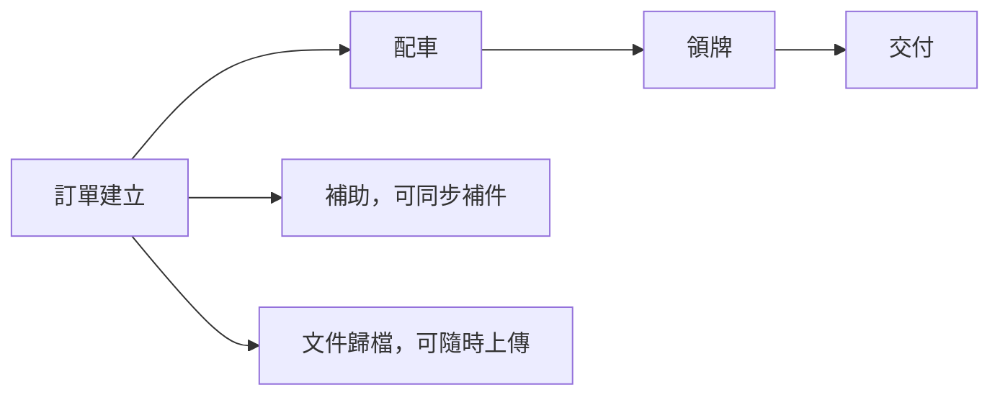

# 車輛銷售管理系統｜使用者操作手冊

版本：1.0

最後更新：2026-08-06

適用對象：業務、行政、庫存、財務與內部管理人員

> 這是給實際使用者看的手冊，不需要懂程式。登入系統後，也可以按右上角「使用說明」搜尋同樣內容並列印。

---

## 目錄

1. [三分鐘快速開始](#一三分鐘快速開始)
2. [戰情首頁與全欄位搜尋](#二戰情首頁與全欄位搜尋)
3. [建立訂單與草稿](#三建立訂單與草稿)
4. [證件拍照與自動辨識](#四證件拍照與自動辨識)
5. [列印與文件歸檔](#五列印與文件歸檔)
6. [訂單建立後怎麼做](#六訂單建立後怎麼做)
7. [配車](#七配車)
8. [汰舊與補助](#八汰舊與補助)
9. [領牌](#九領牌)
10. [交付](#十交付)
11. [取消與退款](#十一取消與退款)
12. [庫存與快速進車](#十二庫存與快速進車)
13. [資料維護](#十三資料維護)
14. [營運、淨利與對帳](#十四營運淨利與對帳)
15. [歷史 Excel 匯入](#十五歷史-excel-匯入)
16. [列印套表](#十六列印套表)
17. [常見狀況排除](#十七常見狀況排除)
18. [個資與帳號安全](#十八個資與帳號安全)
19. [白話名詞表](#十九白話名詞表)

---

## 一、三分鐘快速開始

### 先記住四件事

1. **每天先看戰情首頁**：優先處理、待配車、進行中與庫存都在這裡。
2. **想找什麼就直接搜尋**：不用先選姓名、電話或車牌欄位。
3. **訂單建立時不配實體車**：訂單成立後，內部人員才到「配車」選引擎／車身號碼。
4. **看不到資料先搜尋，不要重複建立**：避免同一位客人有兩張內容相同的訂單。

### 系統入口圖

```text
電腦上方：戰情首頁｜全部訂單｜營運總表｜資料維護｜使用說明｜檢查更新｜登出

手機下方：   首頁   訂單   ＋新增   營運   資料
```

### 手機加到主畫面後看不到新版

1. 先確認草稿已顯示最新保存時間；正式訂單修改請先按「儲存修改」。
2. 按上方「檢查更新」。
3. 系統提示有新版時，按「重新載入」。

### 登入時要注意

- 帳號或密碼連續錯誤 5 次，系統會暫停該裝置繼續嘗試 15 分鐘，避免帳號遭猜測。
- 不要共用密碼，也不要把密碼寫在瀏覽器可被他人看到的位置。
- 系統以一個工作日為使用週期；長時間未操作後若回到登入頁，重新登入即可，草稿仍以畫面顯示的最後保存時間為準。

### 一張訂單會交給誰


每次接手先看訂單上方的狀態、尚缺項目與處理紀錄；完成自己的工作後，確認畫面已顯示最新人員與時間。不要用 LINE 訊息代替系統紀錄。

### 從 Excel 切換時的三個原則

1. **同一筆資料只決定一個正式來源**：切換日期由管理者公告；不要有人改 Excel、另一人改系統，最後再猜哪份正確。
2. **新訂單先在系統找過再建立**：姓名、電話、證號、車牌或識別號碼至少搜尋一項。
3. **平行期只拿 Excel 核對，不重複手抄**：若發現差異，留下訂單編號與欄位，交由管理者判斷，不自行覆蓋歷史資料。

---

## 二、戰情首頁與全欄位搜尋

### 首頁數字怎麼看

| 區塊 | 意思 |
|---|---|
| 需要優先處理 | 逾期或重大待辦，例如車行交付後缺文件、缺尾款 |
| 待配車 | 訂單已成立，但還沒指定實體車 |
| 進行中 | 已配車，尚未全部交付完成 |
| 可售庫存 | 尚未被訂單保留、可以配出的實體車 |
| 本月成果 | 以實際領牌日期認列，不是訂單建立月份 |

### 像 Excel 一樣搜尋

不必先說要搜哪個欄位，輸入你記得的任何內容：

- `0912`：電話片段。
- `ABC1234` 或 `ABC-1234`：車牌。
- `王小明`：車主姓名。
- `SUI 125`：車型。
- `手機架`：配件。
- 備註、文件名稱、引擎／車身號碼也可以。

搜尋結果會顯示「哪個欄位、哪一段內容」符合。證件號碼在畫面上仍會遮蔽。

### 搜尋不到時

1. 改輸入部分內容，不一定要完整。
2. 移除空格、連字號再試一次。
3. 「最近訂單」只是最新動態；全部資料請進「全部訂單」。

---

## 三、建立訂單與草稿

建立訂單有五個區塊：


### 1. 來源

- **本店**：不用再選來源名稱。
- **合作車行／網路平台**：必須選正確名稱。
- 找不到名稱時，不要亂選，先請管理者到通路資料新增。

### 2. 車主與證件

- 本國自然人：身分證正反面。
- 外籍／居留者：居留證正反面。
- 法人：人員自行填公司名稱、統編、地址與聯絡資料。
- 系統自動辨識後仍要人工逐欄核對。

外籍／居留者目前不需要登記護照資料。法人新車領牌請先準備：

1. 營利事業登記證、公司變更登記表或商業登記抄本影本（擇一）。
2. 政府公文准予登記函或經濟部准予登記函影本（擇一）。
3. 近一期 401 報表影本。
4. 公司大小章。
5. 公司存摺（申請補助時）。

若目前畫面沒有專屬文件名稱，請放到對應工作的「其他文件」，並以「公司名稱－文件名稱」命名，避免領牌時找錯。

### 3. 車輛

- 選品牌車型、車輛年份與車色。
- 此時不選引擎／車身號碼。
- 車型或車色找不到時，先請有權限的人新增或啟用主檔。

### 4. 金額

- 主要付款方式：現金、分期、刷卡。
- 選分期後才會顯示分期公司、期數、開辦費與每期金額。
- 其他費用不是必填，需要時再按新增。
- 金額欄位沒有內容就保持空白，不要為了送出任意填 `0`。

### 5. 其他需求

- 選號方式、交車方式必填。
- 指定地點或委託託運，必須填送達位置。
- 配件可新增多筆，也可刪除。
- 配件選「加購」會計入應收；選「贈送」不計入客人應收。
- 汰舊／補助在訂單只決定是否申請與新舊車主是否同人，詳細資料到後續「補助」處理。
- LicenseWatcher 尚未啟用，指定號碼目前仍由人員依提醒處理。

### 例子：一般現金訂單

> 陳小華到本店買 SUZUKI SUI 125／2026／白色，現金付款、不申請補助、來店取車。

1. 來源選「本店」。
2. 拍身分證正反面並核對姓名、生日、證號、地址。
3. 選 SUZUKI SUI 125、2026、白色。
4. 付款選現金，牌險依單據收取。
5. 選號選無、交車選客人來店取車。
6. 按「建立訂單」。

### 草稿與正式修改差異

| 狀況 | 保存方式 |
|---|---|
| 正在新增訂單 | 自動保存草稿，畫面會顯示時間 |
| 重新開啟草稿 | 繼續自動保存 |
| 已建立訂單後修改 | 必須填變更原因並按「儲存修改」 |
| 不想保留修改 | 按「取消修改」 |
| 刪除草稿 | 草稿與草稿照片一起刪除，無法復原 |

如果顯示其他人正在編輯，只能查看；不要重複建單。對方異常關閉後，約 90 秒鎖定才會失效。

---

## 四、證件拍照與自動辨識

### 正確操作

1. 選「拍照」或「上傳圖片」。
2. 避免反光、模糊、裁切或角度過斜。
3. 看到「正在辨識」後，可先填其他區塊，不必停著等待。
4. 完成後回到車主區，對照照片逐欄確認。
5. 有錯直接人工修正，再勾人工核對。

### 圖片與欄位怎麼對照

```text
┌──────────────┐       ┌──────────────────┐
│ 證件正面照片 │  對照 │ 姓名、生日、證號 │
│ 查看/更換/移除│       │ 逐字人工確認     │
└──────────────┘       └──────────────────┘

┌──────────────┐       ┌──────────────────┐
│ 證件反面照片 │  對照 │ 戶籍／居留地址   │
│ 查看/更換/移除│       │ 留意巷弄樓房     │
└──────────────┘       └──────────────────┘
```

### 常見辨識錯誤

- 姓名少一個字：看正面照片補齊。
- `10樓` 變成 `1樓`：放大反面逐字確認。
- 正反面放錯：按移除後重新上傳。
- 居留證把「就學」當姓名：依照片改回正確中文姓名。
- 辨識失敗：重新拍攝，或人工輸入後核對。

> OCR 是協助輸入，不是最終正確答案。訂單、領牌與補助仍以人工核對為準。

---

## 五、列印與文件歸檔

建立訂單後可一次列印三頁：

1. 客戶留存訂購單。
2. 店家留存訂購單。
3. 個人資料使用同意書。

### 手機列印

1. 按「一鍵列印全部文件」。
2. 系統開啟 PDF。
3. 從手機選擇可用印表機，或分享至可列印的電腦。

### 簽署後

- 訂購單與個資同意書分開拍照／上傳歸檔。
- 目前文件未上傳不會阻擋配車，但仍應依內部作業補齊。
- 版面偏移請調整套表或印表機偏移，不要改訂單資料。

### 證件影本一定要加用途浮水印

1. 到訂單的「訂單資料」頁籤，在車主資料展開「列印／下載浮水印證件」。
2. 每次選擇「限領牌使用」或「限申請補助使用」。
3. 勾選這次要正面、反面或兩面。
4. 按「產生浮水印 PDF」後再列印或下載。

PDF 會顯示用途與當天日期，系統不會改動原始證件照片，並會留下產生人員與時間紀錄。

---

## 六、訂單建立後怎麼做

上方是工作頁籤，不是硬性關卡：



- 補助可以在還沒配車時先作業。
- 文件歸檔可隨時補。
- 領牌必須先配車。
- 一般客戶一定要完成領牌才可交付。

進入訂單後，先看頁籤下方的「尚缺項目」，再處理最接近期限的工作。

---

## 七、配車

1. 進入訂單的「配車」。
2. 清單只顯示相同車型、年份、車色且可售的車。
3. 核對引擎／車身號碼與目前實際位置。
4. 按「確認配車並鎖定」。

### 沒有可選車

- 檢查是否已完成進車。
- 檢查車型、年份與車色是否完全一致。
- 檢查車是否已被其他訂單保留。

### 更換配車

- 更換時必須填原因。
- 已有車牌、領牌完成紀錄或任何領牌文件時，不能直接更換；先由行政處理領牌資料。
- 配車代表保留車，不代表車已實際調到交車地點；實際移動仍要更新庫存位置。

---

## 八、汰舊與補助

1. 在訂單勾選申請汰舊／政府補助。
2. 到「補助」填舊車車牌、補助類型與舊車資料。
3. 新增工業局、環境部、地方政府或其他補助項目。
4. 每一項填預計金額、申請日期與狀態。
5. 上傳固定文件；額外資料放在可新增的「其他補助文件」。

### 新舊車主不同

還需要：

- 舊車主姓名與身分證字號。
- 舊車主身分證正反面。
- 舊車主存摺。
- 新舊車主不同人聲明書。

存摺除了照片，仍需填銀行名稱、分行與帳號。

### 注意

- 汰舊與中古車回收估價不是同一件事，也不強制二選一。
- 其他補助文件不列入固定文件齊全條件。
- 關閉補助不會自動刪除已上傳文件。
- 已取消訂單不能再修改補助。

---

## 九、領牌

### 步驟

1. 確認已完成配車。
2. 填實際領牌日期、領牌縣市與車牌號碼。
3. 上傳新行照、新車領牌登記書、監理站單據、發票與強制險單。
4. 有選號時上傳選號單。
5. 其他保險單可新增多份。
6. 尚缺項目歸零後，按「確認領牌完成」。

### 系統會自動做的事

- 依實際領牌日期與領牌縣市帶入代銷結算成本。
- 依實際領牌日期帶入獎勵與補助版本。
- 油車依級距先試算牌險。

### 例外

- 找不到成本規則：先到車型資料補建適用版本，不要填 `0`。
- 牌險試算與單據不同：以正式單據修正，並在首頁確認差額。
- 電動車／微型電動二輪車公式尚未完整時，以正式單據人工輸入。
- 完成領牌後，文件與配車會鎖定，不能任意修改。

---

## 十、交付

### 一般客戶

必須先完成領牌。

### 合作車行

可以先交車，再補領牌與收款：

- 實際交車後 3 個工作日內補領牌文件。
- 實際交車後 7 個工作日內補尾款。
- 工作日排除週六、週日與系統設定國定假日。

### 交付必填

- 交付方式、時間。
- 收車人、電話。
- 實際交付地點。
- 交付車況。
- 車況、文件、鑰匙、配件贈品與收款五項核對。

託運時，交付時間是交給託運公司的時間，並需填託運公司與目的地。有刮傷或損壞必須勾選並填說明。

---

## 十一、取消與退款

只有**尚未領牌、尚未交付**的訂單可以取消。

1. 展開「取消訂單」。
2. 填取消原因與說明。
3. 系統解除配車，車輛恢復可售。
4. 有收訂金時，登記全額退款。
5. 保存退款金額、日期、方式、交易資訊與證明。
6. 退款完成才算取消完成。

退款金額必須等於訂金，不能少退或用分次退款結案。未收訂金的訂單會直接完成取消。

---

## 十二、庫存與快速進車

### 庫存清單

- 搜尋識別號碼、車型、車色、位置或車況。
- 篩選狀態、車型、車色、實際位置。
- 依日期、車型、車色、識別號碼、狀態或位置排序。

### 快速進車

1. 每一列填一台車。
2. 車型與車色用下拉選擇。
3. 油車填引擎號碼；電動／微型電動車填車身號碼。
4. 填出廠年月；進車日期預設今天。
5. 車況說明選填。
6. 整批確認後建立。

任一列重複、缺資料或車色不屬於車型時，整批不建立。依畫面指出的列修正後再送出，避免只進一半。

### 調車與車況

- 變更實際位置會自動產生調車歷程。
- 車況文字、照片與處理結果會保留當時資料。
- 配車後核心欄位會鎖定；交付完成後只能依規則補充車況。
- 出廠年月用於先進先出，不要只看車型年份。

---

## 十三、資料維護

### 客戶資料

- 從訂單自動彙整。
- 同證件號碼會整理成同一位客戶，能查看所有歷史訂單。
- 客戶資料要修改時，回原訂單修改並留下變更原因。

### 車型資料與生效版本

| 資料 | 依據日期 |
|---|---|
| 售價 | 訂單日期 |
| 分期方案 | 訂單日期 |
| 代銷結算成本 | 實際領牌日期＋領牌縣市 |
| 實銷獎勵、促銷補助、分期補貼息 | 實際領牌日期 |
| 車行傭金／台數獎金 | 規則指定的日期與條件 |

例：8/15 起成本從 65,000 調為 66,000，應新增「8/15 生效」版本，不修改 7/1 舊版本。8/14 已領牌訂單仍保留 65,000。

### 其他共用資料

- 配件：售價、工資與參考成本。
- 合作車行／平台：聯絡窗口、品牌傭金加減額。
- 分期公司：名稱、客服電話。
- 工作日曆：國定假日。
- 品牌牌險：公式、固定總額或人工輸入。
- 台數獎金：車行、品牌、期間、門檻與結算明細。

---

## 十四、營運、淨利與對帳

### 訂單與營運資料的差別

- **訂單**：客人買了什麼、要付多少。
- **營運資料**：公司實際收到、支出與最後獲利。

### 單筆淨利

```text
實際撥款
－成本
－總支出
＋總收入
＋實銷獎勵金
＋促銷補助金
＋分期補貼息
＋強制險傭金
＋信用卡傭金
＝單筆淨利
```

例：75,000－65,000－2,000＋1,000＋3,000＝12,000。

單筆淨利只計這台新車的銷售，不把中古車或配件的獨立獲利加進來。

### 統一撥款對帳

只核對分期公司、網路平台與合作車行：

1. 選對帳對象及「待確認」。
2. 依對方帳本填實際金額、入帳日與收款帳戶。
3. 比較預計金額、實際金額與差額。
4. 差額正確才勾確認並儲存。

差額不是 0 時先不要確認。本頁不處理對方第幾批或批次總額，只確認實際有沒有撥款、金額是否正確。

### 營運資料什麼時候填

| 資料群組 | 何時填／怎麼核對 |
|---|---|
| 實際撥款 | 現金通常等於車款售價；分期依該期數撥款比例試算；網路平台依實際帳本人工填。最後都以實際入帳為準 |
| 成本與支出 | 車輛成本依實際領牌日版本；領牌稅金、強制險、選號、運費、車行傭金等依正式單據填寫 |
| 收入與獎勵 | 領牌稅金、強制險、代辦、選號、分期／刷卡手續費及其他收入分開記；獎勵與補助依實際領牌日版本 |
| 發票 | 發票日期與尾款發票號碼可在領牌前先補，不是完成訂單的必填條件 |
| 電動車帳號 | 只有電動車需要客戶 Email；車控帳號可由 Email 的 `@` 前段帶入，車控密碼可由手機帶入，仍可人工修改。微型電動車不要求 |
| 客服／分期資訊 | 保存當時提供給客人的分期公司客服電話與分期內容，日後主檔修改不應回寫舊訂單 |

> 不確定金額放在哪一欄時，先不要塞到「其他」。保留單據並請財務確認，避免同一筆金額同時算在收入與撥款。

---

## 十五、歷史 Excel 匯入

1. 選匯入類型。
2. 上傳正式檔。
3. 先看預覽：新增、更新、略過、衝突、錯誤與未對應資料。
4. 確認後才寫入。
5. 衝突與錯誤列不會匯入。

第一次正式匯入請由管理者陪同。Excel 少一列不表示要刪除系統資料；不要為了通過預覽而任意修改車牌、證號或識別號碼。

---

## 十六、列印套表

適用信封、報件單、聲明書或其他制式表格。

1. 建立新版套表，不直接覆蓋仍在使用的版本。
2. 背景可使用 Excel、PDF 或圖片；空白信封可不放背景。
3. 設定欄位 X、Y、寬度與字型。
4. 用最近訂單預覽 PDF。
5. 調整印表機偏移。
6. 確認無誤後啟用新版、停用舊版。

預覽與教學不得使用真實證件、電話、地址、銀行或密碼資料。

---

## 十七、常見狀況排除

| 畫面訊息／狀況 | 怎麼處理 |
|---|---|
| 帳號或密碼不正確 | 檢查大小寫；仍失敗請管理者協助 |
| 正在辨識證件 | 可先填其他區塊，不要重傳 |
| 證件辨識失敗 | 重新拍攝或人工輸入，再人工核對 |
| 其他人正在編輯 | 不重複建單；等待對方離開，異常中斷約 90 秒後再試 |
| 建立訂單沒反應 | 看上方錯誤摘要，點項目跳到需修正欄位；不要連按 |
| 找不到來源 | 先建立或啟用通路資料 |
| 找不到車型／車色 | 先建立或啟用車型與顏色 |
| 沒有可配車 | 檢查庫存、車型、年份、車色及車輛狀態 |
| 無法更換配車 | 已開始領牌，先由行政處理領牌資料 |
| 找不到成本規則 | 補建符合領牌日與縣市的成本版本 |
| 領牌不能完成 | 依「尚缺項目」補日期、車牌、成本或文件 |
| 一般訂單不能交付 | 必須先完成領牌 |
| 不能取消 | 訂單已領牌或交付 |
| 取消仍未完成 | 訂金尚未全額退款或退款資料未保存 |
| 目前沒有網路 | 保持頁面開啟，不重複送出；恢復後確認保存時間 |
| 系統暫時無法完成 | 記下查修編號與時間；重複發生再通知管理者 |
| 列印位置偏移 | 調整套表／印表機，不修改訂單內容 |
| 指定號碼監控 | LicenseWatcher 尚未啟用，現階段由人員處理 |

### 看不清楚、按不到或手機鍵盤擋住

1. 先把手機轉回直向；桌機瀏覽器縮放先恢復為 100%。
2. 需要放大文字時，可使用手機的「顯示與文字大小」或瀏覽器縮放；放大後功能仍應可以上下捲動操作。
3. 不要連續快速按同一按鈕。看到「處理中」就等待結果。
4. 若按鈕、欄位互相重疊或放大後無法操作，截圖時不要拍入完整證號、地址或存摺，並提供裝置、瀏覽器與發生時間給管理者。

---

## 十八、個資與帳號安全

1. 每人使用自己的帳號，不共用；系統才知道是誰修改。
2. 公用電腦或手機用完要登出；裝置遺失立即通知管理者。
3. 證件、存摺、補助與領牌文件只放系統，不用 LINE 群組代替歸檔。
4. 下載到手機的證件或存摺，完成送件後刪除本機副本。
5. 車控與電池密碼只填專用欄位，不抄到一般備註。
6. 發現不認識的操作人、異常修改或不該看到的資料，立即停止並回報。

目前系統只開放內部成員，多數功能權限相同；這不代表可查看或修改與工作無關的個資。

---

## 十九、白話名詞表

| 名詞 | 白話說明 |
|---|---|
| 草稿 | 尚未正式建立，系統先幫你保存的訂單 |
| 待配車 | 訂單成立，但還沒指定實際引擎／車身號碼 |
| 配車 | 把一台實際庫存車指定給訂單 |
| 鎖定 | 重要工作完成後，避免其他人誤改 |
| 系統試算 | 系統依規則先算的參考金額，仍需核對正式單據 |
| 應收 | 預計應該收到的金額 |
| 實收 | 實際已經收到的金額 |
| 保存當時資料 | 訂單不會因日後改主檔而改掉當時價格、成本或獎勵 |
| 單筆淨利 | 這台新車銷售最後認列的利潤 |
| 工作日 | 排除週六、週日與系統設定國定假日 |
| 對帳 | 核對預計撥款與實際入帳是否一致 |

---

## 需要協助時，請提供什麼

請先記錄：

- 發生日期與時間。
- 使用手機或電腦。
- 訂單編號（如果有）。
- 你按了哪個按鈕。
- 畫面顯示的完整訊息。
- 查修編號（系統錯誤頁會顯示）。

請不要在求助訊息中貼完整身分證、存摺或密碼。
