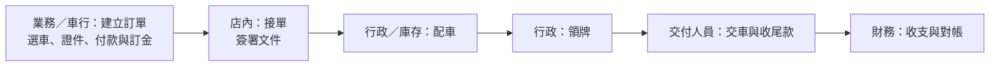

# 車輛銷售管理系統｜使用者操作手冊

適用對象：業務、行政、庫存、財務、內部管理人員與 admin。

> 這本手冊寫給實際操作的人，不需要懂程式。登入後點畫面右上角**自己的名字 → 使用說明**，可以搜尋同樣的內容，也能按「列印／存成 PDF」。使用說明只會顯示你這個帳號用得到的功能。

---

## 目錄

- 一、三分鐘快速開始
- 二、首頁、搜尋與公告
- 三、選車展示與車行帳號
- 四、帳號與權限
- 五、建立訂單與草稿
- 六、證件拍照與辨識
- 七、列印與簽署
- 八、訂單建立後的工作台
- 九、配車
- 十、汰舊與補助
- 十一、領牌
- 十二、交付
- 十三、取消、退款與刪除
- 十四、首次建立基本資料（系統清空後）
- 十五、車輛庫存
- 十六、資料維護
- 十七、價格表分發
- 十八、營運、淨利與對帳
- 十九、報表（自助報表、分類、圖表）
- 二十、歷史 Excel 匯入
- 二十一、列印範本
- 二十二、系統狀態、官網檢查與管理工具
- 二十三、個資與帳號安全
- 二十四、常見狀況排除
- 二十五、白話名詞表
- 需要協助時

> 系統剛清空、要從零開始建資料？先看「十四、首次建立基本資料」。

---

## 一、三分鐘快速開始

### 先記住四件事

1. **每天先看首頁**：確認待處理工作、公告和版本更新。公司經營數字在「營運總表」，不在首頁。
2. **找資料直接搜尋**：在「全部訂單」的「全欄位搜尋」輸入記得的任何片段，不用先選欄位。
3. **建立訂單時不配實體車**：訂單送出後先「待接單」，由店內接單，之後才在訂單的「配車」步驟選引擎／車身號碼。
4. **找不到先搜尋，不要重複建單**：姓名、電話、證號、車牌至少搜一項，確定沒有再建立。

### 畫面上的主要入口

```text
電腦頁首：首頁｜建立訂單｜全部訂單｜營運總表｜報表中心｜SUZUKI 零件｜資料維護區 ▾      右上角：自己的名字 ▾
手機底部：  首頁    ＋建立訂單    全部訂單    營運    更多
```

- 只會看到你有權限的入口。訂單入口依帳號範圍顯示為「全部訂單」「本車行訂單」或「我的訂單」。
- 「資料維護區」滑過會展開分類選單；直接點它可看到全部維護功能。
- **右上角自己的名字**點開後有：外觀配色、使用說明、檢查更新、我的密碼、登出系統。
- 手機「更多」裡有快速前往捷徑、報表中心、SUZUKI 零件圖冊、查看全部功能，以及外觀配色、變更密碼、使用說明、登出。
- 「SUZUKI 零件」會另開台鈴官方零件圖冊，不在系統裡。合作車行帳號看不到這個入口。

### 登入、密碼與登出

- 每個人用自己的帳號，不要共用，系統才記得到是誰操作的。
- 新帳號或密碼剛被重設時，第一次登入會要求設定新密碼，按「儲存新密碼並繼續」。新密碼只有你自己知道，管理者也看不到。
- 自己要換密碼：右上角名字 → **我的密碼**（手機：更多 → 變更密碼）。
- 帳號或密碼連續錯 5 次，會暫停嘗試 15 分鐘。急件請聯絡管理者，不要一直重按。
- 登入一段時間後會自動登出，重新登入即可。草稿以畫面顯示的最後保存時間為準。
- 用公用電腦或手機，結束時從右上角名字 → 登出系統。

### 手機加到主畫面、看不到新版

- 手機瀏覽器選「加入主畫面」（Android Chrome 也可選「安裝應用程式」），之後點圖示就像 App 一樣開啟，名稱是「永湛馭盛車務」。舊的捷徑如果還是開成瀏覽器分頁，刪掉重新加入。
- 系統有新版時，畫面會跳出「系統已有新版，可以立即重新載入」，按「重新載入」；正在填東西可先按「稍後」。
- 想自己確認：右上角名字 → **檢查更新**。顯示「目前已是最新版本」就不用處理。
- 重新載入前，先確認草稿已顯示最新保存時間；正式訂單的修改要先按「儲存修改」。

### 一張訂單會經過哪些人


```mermaid
flowchart LR
    A[業務／車行：建立訂單\n選車、證件、付款與訂金] --> B[店內：接單\n簽署文件]
    B --> C[行政／庫存：配車]
    C --> D[行政：領牌]
    D --> E[交付人員：交車與收尾款]
    E --> F[財務：收支與對帳]
```

打開一張訂單，會看到七個步驟：訂車與配件、訂金、列印與簽署文件、配車、領牌、收入與支出、交車與收尾款。系統只展開現在該做的步驟，其他收成一行摘要，需要時點開即可。接手前先看狀態、尚缺項目與處理紀錄；做完自己的部分，確認畫面已顯示最新人員與時間。不要用 LINE 訊息代替系統紀錄。

### 畫面小提示

- 換頁或送出時，頂端會出現進度條，稍久會顯示「正在送出」等提示；送出中的按鈕會暫停，不必重按。
- 右上角名字 → **外觀配色** 可選「墨黑群青」「夜間深墨」「跟隨裝置」「高對比」等配色，只影響自己。狀態一律同時有文字，不只靠顏色辨認。

---

## 二、首頁、搜尋與公告

### 首頁有什麼

**什麼時候用**：每天登入後的第一站。

首頁依序是：

1. **問候與日期**。admin 右上方另有「管理系統公告」。
2. **待處理工作卡**（有件數時會以深色強調）：
   - 「待接單工作」：店內可接單人員看到。點進去開啟訂單，按「由我接單」。
   - 「等待店內接單」：沒有接單權限的人看到，接單後可在訂單上看到接單人與時間。
   - 「未讀通知」：有未讀時才出現，見下方「我的通知」。
   - 「待刪除審核」：只有 admin 看到。
3. **常用功能**：你自己排列的工作入口（見下一節）。
4. **公告與更新**：分成「系統公告與最新消息」與「版本歷程」兩個分頁，上方標示目前執行版本。

**注意**：首頁不顯示財務數字或客戶清單。合作車行登入後看到的是「車行工作台」：建立訂單、訂單進度（查看本車行訂單）、我的接待草稿、個人設定（變更我的密碼）和公告。

### 編輯常用功能

**什麼時候用**：想把自己最常開的功能放在首頁。

1. 首頁「常用功能」右側按 **編輯常用功能**。
2. 依分類勾選功能，可用「搜尋功能」找名稱，或勾「只看已勾選」。
3. 在右側「首頁顯示預覽」按 **上移／下移／移除** 調整順序。
4. 按 **儲存常用功能** 才生效；按「取消，返回首頁」不儲存。「恢復預設」「全部取消勾選」也只改本次草稿。

**注意**：

- 同一帳號換電腦、換手機都會套用；不影響其他人，也不影響手機「快速前往」。
- 可以存成空的清單。被收回權限的功能會自動消失；需要新功能請找 admin。
- 若另一個視窗已先存過，畫面會提示「收藏已被另一個視窗更新，本次未覆寫」並載入最新設定，確認後再存。
- 沒設定過時，預設是全部訂單、建立訂單、營運總表、報表中心、使用說明（依你有的權限）。

### 手機「更多」與快速前往

**什麼時候用**：在手機上常用的功能想一點就到。限店內帳號。

1. 點手機底部 **更多**，最上方是「快速前往」。
2. 按 **自訂捷徑**，在「設定快速前往」的位置 1～6 各選一個功能；不要的位置選「不使用此位置」。
3. 按 **儲存設定**。

**注意**：設定跟著帳號保存，換手機也在。留白的位置會自動略過。沒設定時預設為價格表分發、合作車行、車輛庫存、機種與售價、客戶查詢、網路平台（依權限）。其他功能按「查看全部功能 →」進資料維護區。

### 閱讀公告與版本歷程

- **公告**：首頁「系統公告與最新消息」列出你能看的公告，置頂的在最前面，時間為台北時間。按「閱讀公告」看全文、圖片，並可下載圖片與附件。每個人看到的公告依公告設定的顯示對象而不同，到期後自動消失。
- **版本歷程**：首頁只列最近兩版，最新一版預設展開，點版本標題可展開或收合；按「查看完整版本歷程」可分頁查看。每版標示「發布時間」（台北）；較早沒有記錄時間的只標「發布日期」。最下方「正式編版前更新紀錄」顯示的是提交日期，不是發布日期。
- 一般帳號只看到和自己可用功能有關的更新項目。

### 我的通知

**什麼時候用**：首頁出現「未讀通知」時。

- 取消待退款、取消結算、分期核貸、例外結案、交付後帳務差額等事件會通知相關人員（例如接單人）。
- 點首頁「查看通知」進入「我的通知」，按「查看訂單」直接處理；看完可按「全部標示為已讀」。
- 沒有設定 Email 時，通知只會出現在系統內。

### 在全部訂單搜尋

**什麼時候用**：找客人、找單、建單前確認有沒有重複。

1. 從頁首「全部訂單」（手機底部同名按鈕）進入。
2. 在 **全欄位搜尋** 輸入任何記得的內容，按「搜尋」：
   - `0912`：電話片段
   - `ABC1234` 或 `ABC-1234`：車牌
   - `王小明`：車主姓名
   - `SUI 125`：車型
   - 配件、備註、文件名稱、引擎／車身號碼、車輛目前位置也可以
3. 結果每列會標出「哪個欄位、哪段內容」符合；超過 6 個欄位會顯示「另 N 個欄位符合」。

**注意**：證件號碼在結果中會遮蔽。原始財務資料只在淨利解鎖後才搜得到。

**搜尋不到時**：

1. 改輸入一部分內容，或拿掉空格、連字號。
2. 檢查「狀態」與「日期、收款與營運條件」是否縮小了範圍，按「清除所有篩選」再試。
3. 你只能搜到自己帳號範圍內的訂單（本人／本車行／全公司），範圍由 admin 設定。

### 篩選、排序與每頁筆數

- **狀態**：選了會立刻套用。除了各訂單狀態，還有「刪除確認中」「需要優先處理」「進行中」「待領牌（含調車）」。
- **日期、收款與營運條件**（展開後設定）：日期依據（實際領牌日期／訂單成立日期／訂單版本日期／實際交付日期）、日期起迄、收款風險（待收款、已有收款待確認、取消待退款、溢收待退、配車保留逾期）、能源別、收款確認、作業提醒（合作車行到期提醒、牌險金額差異待確認）、成交範圍（包含或排除取消／退款）。日期留白時，沒有日期的訂單也會列出。
- **排序**：直接點表頭追加排序，再點一次切換方向。排序條件列可對每一項按「提前」「延後」「移除」；「全部清除」回到預設（訂單版本日期由新到舊）。領牌日期排第一順位時，由新到舊會把未領牌排最前。淨利欄要先解鎖才可排序。
- **每頁筆數**：25、50、75 或 100 筆；分頁可到第一頁、上一頁、輸入頁碼、下一頁、最後一頁。改條件後回第一頁，搜尋與篩選保留。
- **清單內容**：每張訂單顯示訂單成立日期、領牌日期、車號、姓名（下方是訂單編號）、機種、顏色、車行、狀態、備註、淨利。較長的機種或備註點文字可展開。

**狀態怎麼看**：以標籤文字為準。已取消／已退款的標籤帶「×」；本店來源顯示「馭盛」。取消或退款的訂單缺日期顯示「—」，不再提醒補領牌日；淨利顯示「—」，也不計入成交彙總。原本的收退款、費用、日期與異動紀錄都保留。

### 首頁、全部訂單、營運總表、報表中心的分工

| 畫面 | 用途 |
|---|---|
| 首頁 | 自己的待處理工作、常用功能、公告與版本 |
| 全部訂單 | 查單、逐筆處理 |
| 營運總表 | 公司近 12 個月走勢、本月成果、收款風險、即時工作量（待配車、訂單進行中、待領牌、待交付、優先處理）與庫存概況（庫存總數、可售、已預留、車況異常） |
| 報表中心 | 車型、通路等分析報表 |

營運總表的指標定義與淨利解鎖，請見「營運、淨利與對帳」章。

### 系統公告管理（admin）

**什麼時候用**：要通知全體、店內、車行或特定人員時。

1. 從「資料維護區 → 管理者工具 → 系統公告管理」或首頁「管理系統公告」進入。
2. 在「新增公告」填 **標題**、**公告內容（純文字）**，需要時勾「置頂公告」。
3. **公告圖片**：可上傳 JPEG／PNG／WebP，每張最多 8 MB、每則最多 8 張、一次合計 24 MB；圖片固定排在文字上方，用「上移／下移」排順序。**附件**：每次一份，每份最多 20 MB。
4. 選 **顯示對象**：所有人員、店內人員、合作車行人員、指定人員、指定合作車行。選指定時可搜尋（車行可依名稱、代碼、地區或通路類別），再按「勾選搜尋結果」。
5. 設定 **開始顯示時間**、**結束顯示時間**（台北時間；結束可留白）。
6. 按鈕：
   - 「儲存草稿」（新公告）／「儲存」（既有公告）：保持目前發布狀態，新公告不會公開。
   - 「儲存並發布」：到開始時間後顯示給選定對象。
   - 「儲存並取消發布」：立即隱藏，內容保留可再編輯。
   - 「封存／刪除公告」：確認後選「移至歷史公告」或「刪除公告」，兩者都停止顯示並保留紀錄。

**其他做法**：在公告閱讀頁，時間旁按「編輯」可直接改標題、圖片與內容，按「儲存修改」；按「刪除」需再確認。

**注意**：

- 結束時間一到自動隱藏並移到歷史列表；首頁會出現「N 則公告已到期，待整理」，點進去整理。按「查看歷史公告」可搜尋舊公告。
- 每次修改都有版本；展開「最近十次修訂紀錄」可查前後內容。別人剛改過時會阻擋覆寫，請重新開啟再改。
- 圖片和附件只有該公告的顯示對象能看。不要放客戶個資、密碼或財務機密。
- 版本歷程隨系統更新自動出現，不需要也不能用公告編輯。

---

## 三、選車展示與車行帳號

### 選車入口怎麼用

**什麼時候用**：客人或車行要看車、選色、比較現金與分期，再接續下單。

1. 按「建立訂單」（有選車權限時會先進選車頁「選一台適合的車」）。
2. 用 **品牌、車型、型號、能源別** 下拉縮小範圍，選好就自動更新，不用按套用；「清除篩選」回到全部。畫面會顯示「共 N 款車型／M 個車色選項」。
3. 每個啟用車色是一張卡，標示「年式/型號/型式/顏色」與售價。沒有照片的顯示「此車色圖片待補」，一樣可以選。
4. 按 **查看車款與分期**，詳細頁會直接帶入該車色；要換色才展開「更換車色」。
5. 在「售價與分期」的 **選擇付款方式** 點現金或某家分期公司／期數，核對售價、每期金額與開辦費。
6. 最下方按 **確認選擇，接續填單**（未登入時為「登入並接續填單」），車款、車色、付款方式會一起帶進訂單。

**注意**：

- 已知道車款、或要賣尚未上架的車型時，按選車頁上方的「直接填寫訂單」。
- 選車頁不用登入也能瀏覽（登入頁也有「先看看車款」），可以分享給客人看；接續填單時才需要登入。
- 帳號只有瀏覽權限時，詳細頁顯示「此帳號僅可查看；下單權限請洽 admin」，不會出現下單按鈕。
- 選車頁只顯示對客售價與分期，不顯示成本、佣金或撥款。若方案停用或價格變動，送出時系統會要求重新確認，不會自動換成別的方案。

### 選車展示管理（admin）

**什麼時候用**：補車色照片、改介紹或調整排序。上架不在這裡設定：機種在「機種與售價」勾選「啟用中」就**自動上架**，取消勾選就**自動下架**。

1. 「資料維護區 → 車輛與商品 → 選車展示管理」。這裡只列**啟用中**的車款，也就是目前已上架的車款。
2. 用品牌、車型、型號、能源別與「關鍵字」縮小範圍，按 **套用篩選**（換上層條件會清掉下層選擇）；「清除篩選」回到全部。換頁會保留條件。
3. 在車款列按 **編輯展示**：
   - **展示設定**：車款介紹、「排序（小的在前）」。
   - **啟用車色圖片**：每個啟用車色一格，可上傳「○○ · 車色圖片」，或勾「移除 ○○ 的展示圖片（保留備份檔）」。
   - **車款主圖與既有圖片對應（進階）**：舊的車款主圖可用「將既有主圖對應至車色」指定給一個車色；其他顏色不會共用這張圖。
4. 選檔後立即預覽並標示尚未儲存；不想要就按「取消此次圖片變更」恢復原圖。
5. 按 **儲存展示設定** 才真正上傳與生效。

**注意**：

- 圖片每張最多 8 MB，支援 JPEG、PNG、WebP；只上傳有使用權的圖片。格式或大小不對會提示，請重選或取消變更。
- 不選新檔就保留原圖；同一色不能同時上傳又移除。重新整理或表單有其他錯誤時，已選的檔案要重新選。
- 車色要先在機種資料啟用才會出現在這裡；沒有啟用色時頁面會提示。要改規格、車色、售價或分期，點頁面上方「修改機種規格、車色、售價與分期」。
- 要讓車款下架，請到「機種與售價」取消該年式的「啟用中」；重新勾選啟用就會再上架。
- 未上架的車款與圖片不公開，只有 admin 能預覽。停用的車型不會列出，原有圖片保留。
- 編輯途中車款被停用、或別人已改過圖片，儲存會被擋下，請重新整理再操作。
- 頁首「查看公開入口」可直接看客人看到的選車頁。

### 原廠車型比對（admin）

**什麼時候用**：確認 SYM、SUZUKI 官網有沒有新車、改款或可補的車色圖片。

1. 「資料維護區 → 車輛與商品 → 原廠車型比對」，或選車展示管理頁首的同名按鈕。
2. 選上方 SYM／SUZUKI 分頁，按「只檢查 ○○」或「兩家一起檢查」，約 2～3 分鐘，可先離開。
3. 依三個分頁處理：
   - **待對應**：確認系統車型後按「確認對應」；系統沒有的按「系統沒有，從官網建立車型」（建立後為停用、未上架）；不需要的按「忽略這款」。
   - **有變動**：車色、圖片、規格、官網標籤或建議售價變了。看過按「已確認變動」；改款按「改款：建立新年式」，舊年式與既有訂單不變。
   - **可補圖**：勾選後按「補上勾選的圖片」，只補目前沒有圖片的車色，不覆蓋既有圖片。

**注意**：系統每週一清晨自動檢查，有新車、變動或讀取失敗時以系統內通知告訴 admin。比對只提醒，售價不會自動修改。

### 合作車行的登入帳號（admin）

**什麼時候用**：車行新進人員要開帳號、調整功能、離職停用或忘記密碼。

**開新帳號**

1. 「資料維護區 → 通路、客戶與人員 → 合作車行」，進入該車行後切到 **登入帳號** 分頁，按「＋ 新增人員帳號」。也可以在「帳號與權限」按「＋ 建立車行帳號」，選所屬合作車行後按「接續建立帳號」。
2. 填顯示名稱與登入帳號；可按「使用建議帳號」（車行代碼＋人員序號，同店多人不重複）。
3. 輸入臨時密碼兩次。車行帳號第一次登入一定要改密碼。
4. 勾選這個人可用的功能：
   - 選車下單入口
   - 可查詢訂單（依下方資料範圍）
   - 可建立訂單與使用自己的草稿
   - 下單金額調整（成交價、配件調價、自訂分期）
   - 可贈送配件（不代表可修改售價）
   - 可列印客戶簽署文件（不含內部財務）
   - 訂單資料範圍：本人建立的訂單／所屬車行的訂單
5. 按 **確認開通並套用以上權限**，把臨時密碼親自交給本人。

**注意**：

- 新帳號預設可選車、查詢與下單，訂單範圍預設為**本人建立的訂單**；要看同車行其他人的單，改成「所屬車行的訂單」（也包含馭盛代開的單）。
- 下單需同時開放查詢訂單。取消建立訂單後，帳號變成唯讀進度。「本大項全選／全部取消」只影響這一區。
- 車行帳號一律只看得到所屬車行的資料，看不到公司財務、成本、佣金或其他車行。
- 帳號清單的「編輯帳號與功能」「重設密碼」會帶到「帳號與權限」的人員工作區，兩邊是同一份設定。停用帳號請在工作區的「帳號資料」取消「帳號啟用中」；歷史紀錄都保留。
- 只有 admin 能管理車行帳號。一人一帳號，不要共用。

---

## 四、帳號與權限

### 誰可以做什麼

- **admin**：唯一能決定每個人看得到哪些畫面、能做哪些操作，以及管理車行帳號與單筆訂單授權。
- **獲授權的帳號管理人員**（畫面權限「帳號管理（不含畫面授權）」）：可建立內部帳號、編輯基本資料、停用與重設密碼，但不能授權畫面，也不能把人升為系統管理者。
- 入口：「資料維護區 → 管理者工具 → 帳號與權限」。

### 帳號清單

- 上方統計卡：全部帳號、使用中、已停用、管理者，點一下即篩選。
- 篩選：人員身分（馭盛內部人員／合作車行帳號）、所屬車行、搜尋姓名或帳號、帳號狀態（含「尚未登入」），按「套用」。
- 每列顯示帳號狀態、角色（系統管理者／一般人員）、「待變更密碼」與最近登入時間。
- 最下方「帳號異動紀錄」可展開最近 20 筆建立、修改、停用、重設紀錄。

### 建立內部帳號

1. 按 **＋ 建立內部帳號**。
2. 填「顯示名稱」（畫面上用來辨識是誰改資料）和「登入帳號」（建議好辨識的英文，不分大小寫檢查重複）。
3. 在「設定臨時密碼」按 **產生安全密碼**，再按「複製密碼」；或自己輸入兩次。密碼至少 8 碼，不能太常見或只有數字。
4. 保留勾選「建立後立即啟用」「首次登入必須變更密碼」。「系統管理者」只給要管理帳號與系統設定的人。
5. 按 **建立帳號**，立刻把臨時密碼交給本人；之後系統不會再顯示。
6. admin 接著在該人員的權限工作區設定畫面與訂單範圍（見下方）。

### 停用與啟用帳號

**什麼時候用**：離職、長假或暫停使用。不要刪帳號。

- 內部帳號：在帳號清單直接點該列的「使用中」開關，確認後變「已停用」；再點一次可恢復。自己的帳號不能停用。
- 車行帳號：按「管理帳號與權限」→「帳號資料」，取消「帳號啟用中」後儲存。
- 停用後無法登入，歷史操作紀錄全部保留。

### 重設密碼

**什麼時候用**：有人忘記密碼。

1. 帳號清單該列按 **重設密碼**。
2. 按「產生安全密碼」或輸入「新臨時密碼」兩次。
3. 建議保留「下次登入必須變更密碼」，按 **確認重設密碼**。
4. 把臨時密碼交給本人。

**注意**：重設後，這個帳號在其他裝置上的登入會立即失效。不能重設自己的密碼，自己改密碼請用右上角名字 → 我的密碼。

### 人員權限工作區（admin）

在帳號清單按該人員的 **管理帳號與權限**，有四個分頁：

| 分頁 | 設定內容 |
|---|---|
| 01 帳號資料 | 顯示名稱、登入帳號、系統管理者、帳號啟用中 |
| 02 畫面與操作 | 可用的畫面與每個畫面能查看、操作、匯出／列印 |
| 03 訂單範圍 | 下單身分、所屬店別或車行、可查看哪些訂單 |
| 04 指定訂單 | 單張訂單的例外授權 |

admin 帳號本身固定為最高權限，「畫面與操作」「指定訂單」不能調整。

### 畫面與操作

1. 依分類（建立訂單、全部訂單、營運總表、報表中心、資料維護區）勾選每個畫面的「查看」「操作」「匯出／列印」。
2. 可用「搜尋畫面」找名稱，「顯示」選全部、已開放或有變更。「本大項全選／全部取消」只影響該分類（包含被搜尋藏起來的項目）。
3. 要和某人一樣，可用「複製另一位人員至預覽」→「複製並預覽」。
4. 按 **預覽變更**，確認新增／收回的項目後按 **確認並套用**；要改就按「返回調整」。
5. 「權限異動歷程（最近 20 筆）」可查每版內容，按「還原此版並預覽」回到舊設定。

**注意**：

- 取消「查看」會一併取消操作與匯出。勾選不會把人升為管理者。
- 「查看」代表看得到該畫面原有的統計與摘要，不等於「只看自己的資料」；看哪些訂單由「訂單範圍」決定。
- 建立訂單、查詢訂單、列印客戶文件、贈送配件、下單金額調整、訂單內部財務編輯彼此獨立，要分別勾。
- 套用後對方下一次操作就生效，不需要重新登入。

### 訂單範圍

- **下單身分**：店內人員或合作車行。合作車行必須選所屬車行。
- **訂單資料範圍**：本人建立的訂單、所屬車行的訂單、全公司訂單（僅店內）。
- 舊 Excel 匯入、沒有記錄建立者的訂單不會自動歸到任何人。
- 變更所屬車行會立刻改變對方看得到的訂單；身分或車行變更後，原本的單筆授權會失效，需要重新確認。

### 指定訂單（單筆授權）

**什麼時候用**：某人平常看不到某張訂單，但這張需要讓他查看或列印；或反過來要禁止。

1. 在「指定訂單」分頁用訂單編號或車主姓名「搜尋訂單」；也可以從訂單頁的「管理本單權限」選人員後「前往帳號與權限」。
2. 「設定方式」選「沿用一般設定」或「本筆自訂」。
3. 本筆自訂時，勾選「可以查看這筆訂單」「可以列印訂購單與客戶簽署文件」；沒勾就是禁止（連直接開列印網址也禁止）。
4. 填「修改原因」，按 **儲存本筆權限**，立即生效。畫面會顯示「目前可以查看／目前可以列印」的實際結果。

**注意**：帳號本身沒開對應功能時，單筆授權不會偷偷擴權，要先在畫面與操作開放。改回沿用一般設定，可能恢復原本範圍內的權限。

### 查看淨利

**授權（admin）**：在「畫面與操作 → 全部訂單 → 訂單與作業」勾選「查看淨利（另需本人密碼解鎖）」的查看；要下載含淨利的資料，再勾匯出。舊帳號不會自動取得。

**解鎖（使用者）**：

1. 全部訂單清單標題列顯示「淨利已鎖定」，按 **輸入密碼查看**。
2. 在「解鎖淨利」輸入**自己的**登入密碼，按 **驗證並解鎖**。admin 也一樣要驗證。
3. 解鎖後 5 分鐘內可看淨利，翻頁不會延長；隨時可按「立即鎖定」。從匯出進來解鎖的，驗證後會出現下載按鈕。

**注意**：

- 未解鎖時，淨利欄不顯示、不能依淨利排序，營運總表的淨利數字也會隱藏；含淨利的匯出與原始財務資料需要解鎖。
- 密碼錯太多次要等 5 分鐘再試。改密碼、被收回權限或登出後要重新解鎖。
- 已下載、截圖或抄下的內容無法收回；不要把淨利寫在一般備註。財務資料的編輯權限另外授權。

---

## 五、建立訂單與草稿

### 什麼時候用

客人決定購車、要留下訂單時。店內與合作車行用同一套流程；畫面不會出現其他客戶的訂單，也不會出現成本、佣金或淨利。

### 先選車款與付款方案

1. 按主選單的「建立訂單」，進入選車頁。
2. 用「品牌 → 車型 → 型號 → 能源別」下拉選單縮小範圍；每個啟用的車色各一張卡，沒有照片的車色也能選。
3. 點車色卡的「查看車款與分期」，詳細頁會直接帶入這個顏色。要換色時再展開「更換車色」。
4. 在「售價與分期」選現金，或選分期公司與期數，核對車價、每期金額與開辦費。
5. 按頁面最下方的「確認選擇，接續填單」。

- 進入填單後，最上方會顯示「已選車款與付款方案」。要改時按「更換車款／付款方案」，車主資料不會被清空。
- 如果原方案已停用、到期或價格有異動，系統會擋下並要求重新選擇，不會自動改套其他方案。
- 只有瀏覽權限的帳號看不到下單按鈕；請洽 admin 開通。

### 填單五個步驟

畫面一次只顯示一步，上方步驟列標示目前進度。

| 步驟 | 要做什麼 |
|---|---|
| 1 車款與來源 | 確認車型、車色、車輛類別、交易類型與訂單來源 |
| 2 配件與需求 | 配件、是否有汰舊、選號方式、交車方式、備註 |
| 3 車主與證件 | 拍證件正反面、核對車主資料（見第六章） |
| 4 付款與訂金 | 付款方式、車價、分期、訂金、其他費用 |
| 5 確認送出 | 核對整張摘要後建立訂單 |

- 每按一次「下一步」，系統會存成草稿並檢查這一步；有缺漏時停在原步驟，畫面上方列出「這一步還有資料需要處理」。
- 前面沒完成不能跳到後面（尚未開放的步驟呈灰色）；已完成的步驟可以點步驟列或按「上一步」回去改。

#### 第 1 步：車款與來源

- 從選車頁進來時，車型與車色已帶入。這時只選車型與車色，不選引擎／車身號碼，實體車在接單後才配。
- **訂單來源**：本店、合作車行或網路平台。合作車行與網路平台一定要選正確的來源名稱；找不到時請有權限的人到「資料維護區」新增，不要亂選。
- **交易類型**（一般新車、領牌車、試乘車、中獎車、中古車交易、其他）和來源是兩件事，分開選。
- 合作車行帳號的來源固定為自己的車行。店內幫合作車行代開單時，會出現「代開訂單的公司確認」，請勾選「我已確認這是實際銷售車行……」，訂購單與個資同意書會用該車行的公司資料。

#### 第 2 步：配件與需求

- 按「＋ 新增配件」，選配件與數量，系統帶入售價與工資。類型選「加購」會算進客人應付金額；「贈送」不算。清單沒有的配件選「其他」再填名稱（需有權限）。
- 「是否有汰舊」可先選「待確認」；是否真的申請補助由店內後續處理（見第十章）。
- 選號方式：不選號、指定號碼監控、一般領牌偏好。系統不會自動搶號，指定號碼由人員處理。
- 交車方式必選。選「送至指定地點」或「委託託運公司」時，一定要填送達地點／託運目的地。
- 下方「下訂附件」可附分期表與補充檔案，會跟著草稿保存。

#### 第 3 步：車主與證件

本國自然人上傳身分證正反面，外籍／居留者上傳居留證正反面，法人自行填寫公司資料。證件辨識完成前不能按「下一步」。詳細操作見第六章。

#### 第 4 步：付款與訂金

- 付款方式：現金、分期、刷卡。選分期才會出現「分期資料」：先選「分期公司（車型方案）」與「期數與每期金額」，再按「套用選取方案」。
- 車價會自動帶入。若成交價不同，有調價權限的人可修改並填原因；沒有權限的人請寫在備註，由有權限的人核對。
- **訂金**：現金單填客人這次實際要付的金額；分期單預設以加購配件金額當訂金，可修改，改過後不會再被自動蓋掉。
- 其他費用不是必填，需要時按「＋ 新增費用」。沒有的金額請留空，不要為了送出亂填 0。
- 看不到訂金或牌險區塊，表示你的帳號不處理店內財務，由店內人員接手。

#### 第 5 步：確認送出

1. 逐段核對摘要；要改哪一段，就按該段的「修改」。
2. 店內有接單權限的人，可以勾「由我接單」，建立後直接進入待配車；不勾就先進「待接單」。
3. 按「確認並建立訂單」。系統會再整張檢查一次，有問題會帶回該步驟，不會建立不完整的訂單。

### 送出之後

- 畫面顯示「訂單已成立」與訂單編號，並直接詢問「這次要怎麼簽？」（見第七章）。也可以按「回首頁」或「再建立一筆」。
- 沒有勾「由我接單」的訂單會顯示「待接單」。店內人員在首頁「待接單工作」或訂單頁的接單進度按「由我接單」；系統記下接單人與時間，合作車行在自己的訂單也看得到。
- **還沒接單的訂單不能配車。**

### 草稿

- 開始填寫後會自動存草稿，畫面上會顯示最後儲存時間。
- 接續填寫：從「我的接待草稿」（只列你自己的草稿）按「繼續本筆下單」，或從全部訂單的「未完成草稿」按「接續填單」；會回到還沒完成的那一步。合作車行從自己的訂單列表「繼續填寫草稿」。
- 不要的草稿按「刪除草稿」，草稿與照片會一起刪除，無法復原。
- 畫面顯示其他人正在編輯時，請不要重複建單。對方異常關閉後，約 90 秒鎖定才會解除。

### 建立後要修改訂單

1. 在訂單頁按「編輯訂單」。
2. 修改後填寫「變更原因」，按「儲存修改」；不想保留就按「取消修改」。正式訂單不會自動暫存。
3. 已交車的訂單仍可做「完成後修正」：須勾選確認，交付狀態不變。

注意：

- 修改車主資料、車型車色、價款、配件、費用、優惠、付款方式、補助或開單公司後，原本簽好的訂購單會失效，需要重簽（見第七章）。
- 若同時有人改到同一欄位，系統會讓你選「採用最新內容」或「保留我的內容」，不會直接覆蓋。
- 已登記取消的訂單不能再修改內容。

---

## 六、證件拍照與辨識

### 正確操作

1. 在「車主與證件」先選車主類型。
2. 點證件正面、反面欄位，直接拍照或從相簿選圖。避免反光、模糊、裁切或角度太斜。
3. 正反面都上傳後會自動開始辨識，畫面顯示「正在辨識證件資料」。這時可以先填電話、Email。
4. 出現「辨識完成，請核對資料」後，姓名、證號、生日、地址欄位才會顯示。逐欄對照照片：正面核對姓名、生日、證號；反面核對地址（巷、弄、樓、房）。
5. 有錯直接修改，再勾「已人工核對證件」，按「下一步」。

- 辨識完成前，「已人工核對證件」與「下一步」都是灰色不能按。
- 照片要換時按「更換」，或「移除正面照片／移除反面照片」後重拍；換照片會重新辨識。需要時可按「重新辨識」。

### 照片拍錯時

系統會直接指出哪一張有問題，請依提示重拍：

- 正反面放反，或兩張是同一面。
- 拍成健保卡、駕照。
- 本國人上傳居留證，或外籍人士上傳身分證（請確認車主類型是否選對）。
- 太模糊、反光，或看不出是證件。

### 真的無法辨識時

辨識未通過時，下方會出現「我已人工核對證件正反面」並說明原因。只有在你親自確認照片確實是車主本人的證件正反面後，才勾選這一項，再勾「已人工核對證件」即可繼續。訂單紀錄會留下這次人工核對與原因。

### 不同車主類型

- **本國自然人**：身分證正反面。
- **外籍／居留者**：居留證正反面，另填英文姓名、國籍、居留期限；不需要登記護照。
- **法人**：不做證件辨識，自行填公司名稱、統一編號、公司地址與聯絡資料。法人領牌請另外準備：登記證明影本、核准登記函影本、近一期 401 報表影本、公司大小章；申請補助另備公司存摺。沒有專屬欄位的文件，放到對應工作的其他文件並以「公司名稱－文件名稱」命名。

### 常見辨識錯誤

- 姓名少一個字：看正面照片補齊。
- 「10樓」變「1樓」：放大反面逐字確認。
- 居留證把「就學」等字當成姓名：依照片改回正確姓名。

> 自動辨識只是幫忙輸入。系統無法判斷證件真偽，也無法比對正反面是不是同一人，一定要人工核對。

### 列印加浮水印的證件影本

領牌或申請補助需要證件影本時，一定要加用途浮水印：

1. 打開訂單的「訂車與配件」，在「車主資料」展開「列印／下載浮水印證件」。
2. 選「限領牌使用」或「限申請補助使用」。
3. 勾選要正面、反面或兩面。
4. 按「產生浮水印 PDF」，再列印或下載。

PDF 會印上用途與當天日期，原始照片不會被改動，系統會記錄產生的人員與時間。

---

## 七、列印與簽署

### 什麼時候簽

訂單建立後，畫面會問「這次要怎麼簽？」。車輛訂購單需要訂單編號，所以一定在建立後才簽。每張訂單可自己選一種方式：

- **在行動裝置上簽名**：把平板或手機交給客人直接簽，不用列印。
- **印出紙本給客人簽**：印出來簽完，再拍照或掃描上傳。

當下沒空處理也沒關係，之後到訂單的「列印與簽署文件」步驟，或按頁首「簽署與列印文件」即可。

### 在行動裝置上簽名

1. 按「在行動裝置上簽名」，畫面進入「客戶電子簽署」。
2. 請客人看過車輛訂購單與個人資料使用同意書的內容；勾選要簽的文件（「簽署這份文件」）。
3. 確認「簽署人姓名」，勾選同意以電子方式簽署。
4. 請客人用手指或觸控筆在簽名框簽名；簽歪了按「清除重簽」。
5. 按「確認簽署」。同一個簽名會蓋到每一份勾選的文件，並註記簽署時間與簽署人。
6. 出現「簽署完成」後，請客人把裝置交還。客人要紙本時，勾選聯別後按「列印勾選的文件」，印出的是含簽名的版本；不需要就按「完成，返回訂單」。

### 印出紙本給客人簽

1. 按「選擇要印的聯別」，勾選「訂購單・店家留存聯」「訂購單・客戶留存聯」「個資同意書」。
2. 按「列印勾選的文件」，系統開啟 PDF；手機可選印表機，或分享到可列印的電腦。
3. 客人簽完後，到訂單的「列印與簽署文件」步驟，分別按「上傳訂購合約附件」「上傳個資同意書附件」。兩份分開上傳，日後才能單獨查閱。

### 改了訂單要重簽

- 訂購單上的內容（車主資料、車型車色、價款、配件、費用、優惠、付款方式、補助、開單公司等）修改後，不論原本是電子簽或紙本，原簽署都會失效，狀態顯示「內容已變更，需重簽」。
- 個資同意書只有在車主姓名、證件號碼或開單公司改變時才需要重簽。
- 只登記收款或完成領牌，不影響已簽好的文件。

### 其他列印

- 「訂單已成立」頁：「列印本筆訂購單」「列印全部客戶簽署文件」。
- 「列印與簽署文件」步驟：「列印空白合約」「列印空白同意書」「查看目前附件」，以及「其他制式套表」。
- 開單公司顯示「待 admin 確認」時，請先請 admin 確認開單公司再列印。
- 版面偏移請調整列印範本或印表機偏移，不要改訂單資料。

### 注意

- 簽署文件沒補齊不會擋住配車或交車，但仍應依內部作業補齊；系統會在「建議下一步」提醒「補上簽署文件」。
- 步驟摘要會顯示每份文件的狀態：已電子簽署、已上傳、需重簽、未簽署。

---

## 八、訂單建立後的工作台

### 畫面怎麼看

打開一張訂單，上方是步驟列，下方每個步驟都可以展開或收合：

1. 訂車與配件
2. 訂金
3. 列印與簽署文件
4. 配車
5. 領牌
6. 收入與支出（有財務權限才看得到）
7. 交車與收尾款

另外還有「汰舊補助」「取消與結案」兩個區塊，以及最下方的「處理與修改紀錄」。

- 打開訂單時，系統只展開目前該做的步驟，其他收合成一行摘要，隨時可點開。
- 每個步驟右側標示：已完成、目前步驟、待處理、隨時可填、尚未開放。
- 步驟不是硬性關卡：汰舊補助、簽署文件可隨時處理；但領牌要先配車，一般客戶要先完成領牌才能交車。

### 建議下一步

步驟列下方會出現一張「建議下一步」卡：

- 上方是一項最需要處理的工作，按按鈕直接前往；人已經在那個步驟時會標示「目前作業」。
- 「另外可處理」最多列兩項可同時進行的工作，例如補助、補簽文件、合作車行先領車。
- 不想一直看到時按「收合」，會縮成一列；按「查看」再展開。工作不會因此消失。
- 完成配車、領牌、交車或退款後，建議會自動換成下一項。系統不會自動替你配車、完成領牌或送出資料。

常見的建議：

| 畫面顯示 | 意思 |
|---|---|
| 等待店內接單 | 先由店內人員接單，才能配車 |
| 選擇實體車輛 | 有符合的車，可以配車 |
| 先建立符合的進車資料 | 沒有符合的庫存，按「前往快速進車」 |
| 配車已保留 N 天仍未領牌 | 配車超過 30 天還沒領牌 |
| 補齊領牌資料（尚缺 N 項） | 領牌資料或文件還沒齊 |
| 合作車行可先領車 | 合作車行可先交車，領牌資料於交車後三個工作日內補齊 |
| 完成取消退款結算 | 已登記取消，待完成退款 |

### 訂金

- 「訂金」步驟顯示約定訂金與收款狀態。客人付了訂金，有財務權限的人填實收金額、收款日期、收款方式，勾「確認此筆訂金已收妥」，按「登記訂金收款」。
- 已確認的收款就是入帳，不能直接改或刪；登記錯誤請到「收入與支出」以沖銷更正。
- 本單沒有約定訂金時可略過這一步。

### 頁首按鈕

- 「編輯訂單」：修改內容（見第五章）。
- 「簽署與列印文件」：跳到第 3 步。
- 「收入與支出」：跳到收款與收支（需財務權限）。
- 「刪除訂單」：送出刪除申請（見第十三章）。

### 一張現金訂單從頭到尾

> 陳小華到本店買 SUZUKI SUI 125 白色，付現、不申請補助、來店取車。

1. **選車**：「建立訂單」→ 篩選 SUZUKI → 點白色車卡「查看車款與分期」→ 選現金 →「確認選擇，接續填單」。
2. **車款與來源**：確認車型車色，來源選「本店」→「下一步」。
3. **配件與需求**：選號方式「不選號」、交車方式「客人來店取車」→「下一步」。
4. **車主與證件**：拍身分證正反面，辨識完成後核對姓名、證號、生日、地址，勾「已人工核對證件」→「下一步」。
5. **付款與訂金**：付款方式「現金」，訂金填客人今天付的 5,000 元 →「下一步」。
6. **確認送出**：核對摘要，勾「由我接單」→「確認並建立訂單」。
7. **簽署**：在「這次要怎麼簽？」按「在行動裝置上簽名」，客人簽完按「完成，返回訂單」。
8. **訂金**：在「訂金」步驟確認實收 5,000 元 →「登記訂金收款」。
9. **配車**：在「配車」選排在最上面的車 →「確認配車並鎖定」。
10. **領牌**：填實際領牌日期、領牌縣市、車牌號碼 →「儲存領牌資料」→ 上傳新行照照片、新車領牌登記書 →「確認領牌完成」。
11. **交車**：在「交車與收尾款」填交付資料、勾四項核對，在尾款區登記客人付的尾款 →「收尾款並完成交車」。

---

## 九、配車

### 什麼時候用

訂單已接單（待配車），要指定一台實體車保留給客人時。

### 怎麼做

1. 展開訂單的「配車」步驟。
2. 下拉選單只列出同車型、同車色、目前可銷售的車。每個選項顯示引擎／車身號碼、出廠年月與存放位置；油車看引擎號碼，電動車看車身號碼。
3. 依建議選第一台（見下方順序），核對號碼與實際位置。
4. 按「確認配車並鎖定」。

### 配車順序與原因

- 標「★ 優先配車」的車排最上面；同一級再依出廠年月由舊到新，沒填出廠年月的排最後。
- 出廠超過 3 個月的車會自動變成優先配車；未滿 3 個月的車，可由人員在車輛庫存列表手動開啟。
- 畫面會顯示「同車型車色待配車 N 張，本單排第 N 位」。待配車訂單依接單先後排隊。
- **必須填「未依順序配車原因」**：本單不是排第一位，或沒有選同一級中最早出廠的車。
- **建議填寫**：還有優先配車的車，卻選了一般車。畫面會提醒，但不填也可以配車，提醒內容會記在配車紀錄裡。

### 沒有可選的車

- 畫面顯示「目前無符合的可售庫存」：先確認是否已進車（可從建議下一步「前往快速進車」）。
- 確認車型、年式與車色是否完全一致。
- 車可能已被其他訂單保留，或被標為「車況異常（暫停配車）」。
- 已領牌的車只會出現在交易類型為「領牌車」的訂單。

### 更換配車

1. 在「車輛配對完成」下方展開「更換配車」。
2. 選「新的實體車輛」，填「改配原因」。
3. 按「確認更換配車」。原車恢復可售，新車立即鎖定，並留下紀錄。

- 訂單已有車牌號碼、領牌完成紀錄或任何領牌文件時，會顯示「目前無法改配」；請先由行政確認並處理領牌資料。
- 配車只代表保留，不代表車已移到交車地點；車實際移動時仍要更新庫存位置。

---

## 十、汰舊與補助

### 什麼時候用

客人要汰舊換新、申請政府補助時。補助和配車互不影響，可以在配車前先收件，交車後也能繼續申請或補件。

### 怎麼做

1. 展開訂單的「汰舊補助」，勾「申請汰舊／政府補助」。勾選後立即啟用並開放文件上傳，不必先儲存。
2. 依實況勾或不勾「新舊車主為同一人」。
3. 填舊車車牌、補助類型；新舊車主不同時再填舊車主姓名與身分證字號。
4. 按「＋ 新增補助項目」，每一筆選類別（工業局、環境部、地方政府、其他）、項目、預計金額、申請日期與狀態，系統自動加總。
5. 填「變更原因」，按底部的「儲存補助變更」（沒有修改時按鈕顯示「資料已儲存」）。
6. 在「補助文件」逐項按「拍照／上傳」；上傳錯誤可「替換」或「刪除」。

### 需要哪些文件

固定文件：舊車主身分證正面、舊車主身分證反面、舊車行照、報廢證明、回收管制聯、舊車主存摺封面；新舊車主不同人時，另需「新舊車主不同人聲明書」。

- 新舊車主同一人時，下訂時已上傳的車主證件與存摺會自動沿用，顯示「已沿用下訂附件」，不必重複上傳。
- 新車主存摺封面可上傳，但不列入必備。
- 額外資料放在「其他補助文件」：填文件名稱，選檔後按「＋ 新增其他文件」。可上傳圖片、PDF、Word、Excel 或文字檔，單一檔案上限 20 MB；不列入齊全條件。
- 區塊右上會顯示「N／N 已備妥」或「✓ 資料齊全」；底部列出還缺哪些項目。

### 注意

- 申請金額不等於已入帳。補助撥款進度、匯款帳戶由有財務權限的人在「補助撥款追蹤」登記。
- 汰舊和中古車回收估價是兩件事，也不強制二選一。
- 取消勾選補助不會刪除已上傳的文件，之後再勾可以繼續補齊。
- 訂單已取消或例外結案後，不能再修改補助。
- 舊車主證件的辨識結果與目前資料不同時，可選「保留目前內容」或「採用辨識結果」。

---

## 十一、領牌

### 什麼時候用

已配車、拿到牌照之後。還沒配車時，「領牌」步驟會顯示「尚未開放領牌作業」。

### 怎麼做

1. 展開「領牌」步驟，填「實際領牌日期」「領牌縣市」「車牌號碼」，按「儲存領牌資料」。
2. 在「領牌文件」逐項按「拍照／上傳」：
   - 新行照照片（必填）
   - 新車領牌登記書（必填）
   - 選號單：選號方式不是「不選號」時必填
   - 發票：選填，有就上傳留存
3. 第三人責任險等其他保險，在「其他保險單」填保險名稱、選檔，按「新增其他保險單」，可新增多份。
4. 底部顯示「領牌資料與必備文件已齊全」後，按「確認領牌完成」。尚有缺漏時按鈕無法按，並列出缺哪些項目。

### 系統會自動做的事

- 依車型與實際領牌日期帶入車輛結算成本（領牌縣市只供領牌與營運資料使用，不影響成本）。
- 依實際領牌日期帶入原廠獎勵與補助金額。
- 分期單顯示建立訂單時保存的分期方案預估撥款。

### 遇到例外

- 顯示「找不到符合此車型與領牌日期的成本規則」：請有權限的人到車型資料補建適用版本，補好前無法完成領牌。不要填 0。
- 牌險實際金額與系統試算不同：由有權限的人在「編輯訂單」依正式單據修改，再到「收入與支出」按「確認牌險差異」。
- 微型電動二輪車：依正式單據人工填寫牌險。
- 完成領牌後，領牌文件不能再刪除或替換，也不能更換配車。

---

## 十二、交付

### 一般客戶

必須先完成領牌才能交車。

### 合作車行

可以先交車，再補領牌與款項：

- 交車後 3 個工作日內補齊領牌資料與文件。
- 交車後 7 個工作日內確認款項。
- 工作日不含週六、週日與系統設定的國定假日。
- 合作車行若設有掛帳額度，先交車未收清的金額會累計，超過額度就不能交車；交付區會顯示「車行掛帳」金額與額度。
- 先交車、還沒領牌的訂單顯示「已交車／待補文件」，補完領牌才正式結案。

### 交車前一定要符合

畫面不符合條件時，按鈕顯示「尚未符合交車條件」，下方列出原因：

- 尚未配車。
- 一般訂單尚未完成領牌。
- 折扣申請還在待確認。
- **分期單尚未核准**：在交付區的「分期核貸」選「已核准」並填決定日期，按「更新分期核貸」。
- 一般訂單尾款尚未收清。

### 怎麼做

1. 展開「交車與收尾款」。
2. 核對交付方式、實際交付時間、實際收車人、收車人電話、實際交付地點（收車人預設帶車主，可修改）。託運時，交付時間是交給託運公司的時間，並填託運公司與目的地。
3. 「交付車況」點選「正常」「發現刮傷或損壞」或「其他狀況」。選刮傷或損壞時必填「刮傷／損壞說明」；其他狀況寫在「交付備註／其他狀況說明」。
4. 勾選四項核對：已核對車況、已核對交付文件、已核對鑰匙、已核對配件與贈品。需要時上傳交付照片。
5. 尾款還沒收清時，表單下方會出現「尾款」區塊：填實收金額、收款日期與收款方式。
6. 按「收尾款並完成交車」（尾款已收清時按鈕是「確認完成交付」），再按確認。金額不足時不會交車，也不會記錄收款。

完成後訂單與實體車輛會鎖定。交車後要補收或退差，請到「收入與支出」處理。

---

## 十三、取消、退款與刪除

### 先分清楚

| 情況 | 用哪個功能 |
|---|---|
| 客人不買了，還沒領牌、還沒交車 | 取消訂單 |
| 已領牌，但客人不交車 | 例外結案（領牌後棄單） |
| 訂單建錯、重複，要從清單移除 | 刪除訂單 |

刪除不等於取消，也不代表已退款或已退車。

### 取消訂單（未領牌、未交車）

1. 展開訂單最下方的「取消與結案」，在「訂單取消與退款」按「展開取消流程」（展開本身不會取消）。
2. 填「取消原因」與「取消說明」，按「登記取消訂單」並確認。
3. 已配的車立即解除保留，恢復可售。
4. 沒有已確認的收款：訂單直接變成「已取消／已退款」。
5. 有已確認的收款：訂單變成「取消待退款」，接著做退款結算。進入取消流程後，訂單內容、折扣與配車都會鎖定。

系統會擋下取消的情況：

- 已領牌或已交車（已領牌請用例外結案）。
- 分期公司已撥款。
- 還有已登記但未確認的收款：請先到「收入與支出」確認或清除。

### 取消待退款結算

1. 在「取消待退款結算」查看已收金額。
2. 填「沒收金額」：依約定沒收訂金或扣手續費；不沒收填 0。有沒收金額時一定要填「沒收原因」，且不能超過已收金額。
3. 應退金額 = 已確認實收 − 沒收金額，由系統計算。
4. 填「退款完成日期」，有應退金額時選「退款方式」，視需要填退款帳號／交易資訊、上傳退款證明。
5. 按「確認結算並完成取消」。

- 結算完成前，訂單一直是「取消待退款」，接單人會收到通知，首頁也會提醒。
- 沒收的金額算實際收入，這張訂單之後一律不能刪除（admin 也不行），也不能申請刪除。

### 客人改變心意（撤銷取消）

還在「取消待退款」時，填「撤銷原因」，按「撤銷取消」。訂單回到待配車（還沒接單的回到待接單）；原本配的車已經釋回，需要重新配車。

### 領牌後棄單（例外結案）

已領牌、還沒交車，但客人不要車時使用。

1. 在「取消與結案」展開「領牌後棄單（例外結案）」→「展開結案流程」。
2. 填結案原因、沒收金額（通常含已支出的領牌規費與約定違約金）與沒收原因。
3. 填「領牌車再售價」（必填）、結案／退款日期，有應退金額時選退款方式。
4. 按「確認例外結案」。

- 車輛不會回到新車庫存，而是以「已領牌車」釋回，保留車牌，只能配給交易類型為「領牌車」的訂單。
- 例外結案不列入有效售出、台數與佣金。
- 分期公司已撥款、有未確認收款、或已結算台數獎金時不能結案，畫面會列出原因。

### 刪除訂單（申請與審核）

什麼時候用：訂單建錯或重複，需要從清單移除。

1. 在訂單頁按「刪除訂單」，填「操作原因」，勾選確認後按「送出刪除申請」。
2. 訂單顯示「刪除確認中」；核准前原交易與統計都不變。申請人可以按「取消刪除申請」。
3. admin 從首頁「待刪除審核」或全部訂單上方的「刪除審核」，按「檢查與審核」，再選「確認刪除訂單」或「駁回申請」（駁回要填原因）。

- 只有 admin 能確認刪除；有「編輯訂單」權限不代表能申請刪除。
- 系統會列出「請先處理以下事項」，例如：仍綁定配車、已有領牌資料、已交車、仍在取消待退款、有收款或沒收紀錄、已有台數獎金結算。這些應先走取消、退款或更正流程。
- admin 確認有關聯的訂單時，須勾選「我確認作廢此訂單的影響……」；系統會解除配車、作廢獎金分配，已領牌或已交車的車改為停用待核對，不會當成可售新車。
- 有沒收訂金的訂單例外：一律不能刪除，admin 也無法勾選略過；畫面會顯示「此訂單不能刪除」。

### 已刪除訂單與還原

- 從全部訂單上方的「已刪除訂單／還原」查詢，可用訂單編號或姓名搜尋。
- 已刪除的訂單不出現在一般列表、報表、統計與收款待辦，但原狀態、金額、附件與紀錄都保留。
- 按「檢視與還原」，填原因並勾選確認後按「確認還原訂單」；還原後維持原狀態與金額，不重新計算。
- 刪除時有連動配車或獎金的訂單，只能由 admin 還原；車輛已被其他交易使用時，系統會整筆拒絕還原。

---

## 十四、首次建立基本資料（系統清空後）

系統清空後，只保留帳號與畫面權限、門市（存放地點）、馭盛開單公司、通路類別、工作日與假日設定、報表。其餘資料（品牌、機種、車色、售價、分期、規則、車行、平台、本店人員、庫存、訂單）都要重新建立。請**依下列順序**做，前一步沒做，後一步會選不到或存不了。

### 開始前：請 admin 先確認三件事

| 項目 | 在哪裡 | 說明 |
|---|---|---|
| 馭盛開單公司 | 資料維護區 → 列印範本設定 → 「訂購單公司資訊 · 馭盛與合作車行」→ 馭盛 · 店內預設公司 | 已保留；確認公司全名、統一編號、地址與電話仍正確 |
| 通路類別 | 資料維護區 → 通路類別 | 已保留；確認「本店來源、合作車行、網路平台」三種處理方式各至少有一個啟用中的類別，否則無法新增本店人員、車行或平台 |
| 車行人員帳號 | 資料維護區 → 帳號與權限 | 清空時已自動**停用**所有合作車行帳號（所屬車行已不存在）。等第 11 步建好車行後，到該帳號「訂單範圍」重新綁定所屬車行，再到「帳號資料」勾選「帳號啟用中」並儲存 |

門市（存放地點）已保留，可以直接進車。

### 建立順序

| 順序 | 要建立的資料 | 路徑 | 必填重點 | 缺少時會擋住 |
|---|---|---|---|---|
| 1 | 車輛品牌 | 資料維護區 → 車輛品牌 | 品牌名稱；子品牌（例如 eMOVING）選「所屬主品牌」 | 新增機種、領牌與強制險的「品牌」下拉是空的 |
| 2 | 機種／年式與顏色 | 資料維護區 → 機種與售價 → 「＋ 新增機種／年式」 | 品牌、能源別、機種、原廠型號、年份、型式；油車填排氣量；電動車選電動車領牌級別；同頁「顏色設定」按「＋ 新增顏色」 | 沒有機種或顏色，無法建立訂單、無法進車 |
| 3 | 售價版本 | 機種與售價 → 該年式「編輯」→ 「維護售價版本」 | 建議售價、現金價、訂單生效日期（填今天或更早） | 選車顯示「售價尚未設定」；沒有調價授權的人送出訂單會出現「此車型沒有可帶入的售價版本」 |
| 4 | 啟用機種（自動上架） | 機種與售價 → 該年式「編輯」 | 補好車色與售價後勾選「啟用中」並儲存；系統會自動上架選車展示，不需另外開啟 | 未啟用的機種在「建立訂單」的選車畫面看不到 |
| 5 | 分期公司 | 資料維護區 → 分期公司與方案 → 「＋ 新增分期公司」 | 公司名稱、客服電話 | 分期方案選不到公司 |
| 6 | 分期方案 | 年式編輯頁 → 「維護分期方案」 | 生效日期；每一期數填分期公司、每期金額、開辦費、預估撥款方式 | 分期訂單出現「請選擇此車型目前有效的分期方案」，現金訂單不受影響 |
| 7 | 領牌與強制險 | 資料維護區 → 領牌與強制險 | 品牌、能源別、計算方式、生效日期 | 油車沒設定時用公式試算；**電動車沒設定**，填領牌日期時會出現「尚未建立有效牌險規則」 |
| 8 | 車輛結算成本 | 資料維護區 → 車輛結算成本 → 「＋ 新增成本版本」 | 機種／型號／年份、代銷結算成本、生效日期 | 領牌後成本是 0，單筆淨利不完整 |
| 9 | 原廠獎勵與補助（有才建） | 資料維護區 → 原廠獎勵與補助 | 實銷獎勵金、促銷補助金、分期補貼息、生效日期 | 獎勵與補助不會自動帶入 |
| 10 | 本店人員 | 資料維護區 → 本店人員 | 通路類別、姓名；可填所在店、電話、傭金 | 本店訂單選不到承辦員工（本店單仍可不選） |
| 11 | 合作車行 | 資料維護區 → 合作車行 → 「＋ 新增合作車行」 | 通路類別、車行名稱、地址；勾「合作類別」 | 車行訂單必須選來源；沒勾合作類別不會進入價格表分發 |
| 12 | 車行開單公司（admin） | 合作車行 → 編輯 → 「訂購單公司資訊」分頁 | 公司全名、統編、地址、電話 | 店內不能代開此車行訂單；車行自己下的單不能列印訂購單 |
| 13 | 網路平台 | 資料維護區 → 網路平台 | 通路類別、平台名稱；代碼由系統配置 | 平台訂單選不到來源 |
| 14 | 帳號與訂單範圍（admin） | 資料維護區 → 帳號與權限 → 選人 → 「訂單範圍」 | 車行人員重新綁定所屬車行；店內人員確認預設店別與資料範圍 | 原本的綁定已清空，車行帳號已停用；綁定所屬車行後，到「帳號資料」勾選「帳號啟用中」並儲存。店內人員的預設店別也要重新選 |
| 15 | 車行傭金、台數獎金（有才建） | 資料維護區 → 車行傭金與銷售獎勵／車行台數獎金 | 每個機種的車行基礎傭金；台數門檻 | 傭金為 0，台數獎金不會試算 |
| 16 | 庫存進車 | 資料維護區 → 車輛庫存 → 「＋ 快速進車」 | 車型、車色、引擎／車身號碼、進車日期 | 訂單可以建立，但沒有車可以配 |
| 17 | 第一張訂單 | 上方「建立訂單」 | 依「五、建立訂單與草稿」操作 | — |

工作日與假日設定、報表已保留，不必重建。配件與工資、車行獎勵品項、列印範本（信封、報件單）需要時再補。

### 快速路徑：從原廠官網建立機種（admin）

資料維護區 → 原廠車型比對 → 檢查 SYM／SUZUKI → 在「待對應」按「從官網建立車型」。系統帶入名稱、年份、排氣量與車色，確認型號與型式後儲存。**建立的機種一律是停用、未上架**，在「機種與售價」的「已停用機種」分頁找得到。補好車色與第 3 步的售價後，在年式編輯頁勾回「啟用中」，系統就會自動上架。

### 建完後用一張測試單確認

1. 選車畫面看得到車款與售價。
2. 現金與分期各試一次到確認頁（不送出也可以）。
3. 進一台車，確認配車選單看得到。
4. 有問題先查本章表格的「缺少時會擋住」欄。

---

## 十五、車輛庫存

路徑：資料維護區 → 車輛庫存。

### 庫存清單

- 上方分頁：「現有庫存」放可銷售與仍在處理中的車；「停用車輛」只供查詢。已售出、已交車的車不列入庫存，從訂單仍可開啟車輛資料。
- 搜尋：識別號碼、機種、車色、車行、車況，或調車來源車行名稱。
- 篩選：狀態、機種（同機種不同年式合成一項）、車色、實際位置、車輛來源。
- 排序：進車日期（新到舊／舊到新）、車型、車色、識別號碼、狀態、實際位置、優先配車在前。
- 實際位置沒有選車行時顯示「本店」；放在車行時直接顯示車行名稱。
- 車行調車的車會在識別號碼下方標示「調車｜車行名稱」。
- 車況欄：「車況異常」紅色標示；只有一般說明時顯示「有備註」；其他顯示「正常」。

### 優先配車

- 出廠年月超過 3 個月的車，系統自動開啟並標示「自動」，不能關閉。
- 未滿 3 個月的車可直接在列表手動開啟，標示「人工」；滿 3 個月後仍是「人工」。
- 手動關閉後改回依出廠年月判斷，到期會自動開啟。
- 每次切換都記入庫存異動紀錄。訂單配車時，優先配車的車排在選單最上面；選了其他車會提醒填原因，但不強制。
- 沒填出廠年月的車排在最後，請盡量填寫。

### 快速進車（整批）

按「＋ 快速進車」：

1. 每一列一台車；不夠時按「＋ 新增一列」，填錯按「刪除此列」。
2. 選車型，再選車色（只會出現該車型的啟用顏色）。
3. 填識別號碼：油車填引擎號碼；電動車、輕型電動車、微型電動二輪車填車身號碼。空格與連字號不影響重複比對。
4. 填進車日期（預設今天）與出廠年月（格式 2026/08，可不填，但會影響配車順序）。
5. 選車輛來源：「公司進車」（預設）或「車行調車」；選車行調車時必須填「調車來源」，輸入時會提示先前填過的名稱與啟用中的車行。
6. 車況說明選填。
7. 按「建立全部車輛」。

快速進車一律放在本店。任一列重複、缺資料、車色不屬於該車型，或號碼已在庫存中，整批都不建立；依畫面標示的列修正後再送出。

### 新增單台與編輯

- 「新增單台」可一次填完車型、車色、號碼、車輛來源、實際位置、出廠年月、車況說明與照片。
- 編輯頁可改實際位置：選車行或「本店」，儲存後自動產生調車歷程。
- 車輛來源（公司進車／車行調車）只用來區分與顯示，不影響成本、傭金或報表；它和「實際位置」是兩回事。
- 未配車的車可勾「標記車況異常（暫停配車）」，並必須填車況說明；處理完取消勾選即恢復可銷售。
- 已配車或交付中的車，車型、車色、號碼、日期等核心欄位會鎖定；已交車的車只能補充車況與處理結果。
- 修改可填「異動原因（選填）」，所有修改都留在「歷史異動紀錄」。

---

## 十六、資料維護

資料維護區分三區：「日常資料」、「費率與規則」、「匯入與列印工具」。看不到某張卡片，代表沒有該畫面權限。

### 停用、刪除與生效版本

- 不再使用的資料請**停用**，不要刪除；歷史訂單仍保留原資料。清單多半分「啟用中／已停用」兩個分頁，要恢復時到已停用分頁編輯。
- 有價格或金額的資料用「生效版本」：價格調整時**新增版本**，不要改舊版本。

| 資料 | 系統依哪一天選版本 |
|---|---|
| 售價 | 訂單日期 |
| 分期方案 | 訂單日期 |
| 車輛結算成本 | 實際領牌日期 |
| 實銷獎勵、促銷補助、分期補貼息 | 實際領牌日期 |
| 車行傭金加減 | 實際領牌日期（未領牌前先依訂單日期試算） |
| 車行台數獎金 | 實際領牌日期所在的期間 |

例：8/15 起成本從 65,000 調為 66,000，新增「8/15 生效」版本，不改 7/1 舊版本。8/14 已領牌的訂單仍是 65,000。

### 車輛品牌

- 填品牌名稱、別名（原廠或 Excel 上的其他寫法）、顯示順序。
- 子品牌選「所屬主品牌」，最多兩層。
- 機種、領牌與強制險的品牌都從這裡選。

### 機種與售價

- 「＋ 新增機種／年式」：同一機種的新年式，選「套用既有機種」即可，不必重打名稱。
- 必填：品牌、能源別、機種、原廠型號（可填多個，用頓號或換行分隔）、年份、型式。油車一定要填排氣量；電動車要選「輕型」或「重型」領牌級別。
- 已有庫存的年式不能改能源別。
- 「顏色設定」在同一頁。已被訂單或庫存用過的顏色只能取消「啟用中」，不能刪除。
- 年式編輯頁下方可：「維護售價版本」、「設定傭金與獎勵」、「維護分期方案」、「維護結算成本」、「維護原廠獎勵」，以及修正年份、合併重複年式、移動到其他機種、刪除未使用的年式。
- 售價版本：「建議售價」用於分期，「現金價」用於現金；只填一個時兩種付款都帶這個價。勾不勾「此建議售價包含牌險」依原廠公告。已被訂單使用的版本不能刪除。

### 車輛庫存

見第十五章。

### 配件與工資

配件名稱、售價、工資、參考成本。下單時帶入預設值；人員改價時要在備註寫原因。

### 車行獎勵品項

集中維護實物、紅包／現金、禮券／兌換券、旅遊點數的名稱、單位與成本版本。實際給哪一款車，再到「車行傭金與銷售獎勵」設定。

### 客戶查詢

從訂單自動整理，同證件號碼視為同一位客戶，可看全部歷史訂單。要改客戶資料，回原訂單修改並填原因。

### 通路類別

決定每個來源的系統處理方式：本店來源、合作車行、網路平台。只有處理方式是「合作車行」的來源會套用車行傭金。已有來源使用的類別不能改處理方式，請另建新類別。

### 合作車行

- 清單分「啟用中車行／已停用車行」；可依縣市、行政區、合作類別（可複選）、關係類型、年節名單、LINE 群組篩選。
- 基本資料：車行名稱、負責人與電話、地址（系統自動判定縣市與行政區）、排車容量、掛帳額度、年節送禮名單、LINE 群組、備註。代碼由系統配置。
- 掛帳額度：空白＝不設上限但仍追蹤；0＝必須收清才能交車；超過額度就不能交車。
- 合作類別：三陽 SYM、台鈴油車、台鈴電車，各選「專銷」或「一般」。這會決定價格表分發名單。
- 傭金加減：在合作類別區按「＋ 新增傭金版本」，針對此車行加減每台傭金。
- 編輯頁上方分頁：「基本資料」、「登入帳號」（開通車行人員帳號）、「訂購單公司資訊」（admin 設定開單公司）。
- 停止合作請停用。只有完全誤建、沒有任何訂單、歸屬訂單、停放車輛、台數獎金或匯入對應的車行，才能在編輯頁「車行資料管理」按「檢查並永久刪除」。

### 網路平台、本店人員

- 網路平台：平台名稱、聯絡窗口；來源代碼由系統配置。
- 本店人員：姓名、所在店（永湛／馭盛可複選）、電話、每筆傭金。
- 列表的「啟用中」可直接切換；停用後新訂單選不到，歷史訂單保留。

### 一台車要算給另一間車行

平常不用設定，台數與傭金都歸原車行。

- 建立或編輯訂單時：在「訂單來源」點「這台算給其他車行」，選車行，隨訂單儲存；不需要時按「取消指定，改回原車行」。
- 已儲存、已交付或已完成的訂單：訂單明細標題旁按「調整台數歸屬」（或歸屬區塊的「變更車行」），選車行、填原因，按「儲存歸屬」。選「原銷售車行」恢復預設。
- 本店訂單也可以指定車行：台數與台數獎金算給該車行，不新增基礎傭金；選「不指定車行（保留本店來源）」取消。網路平台訂單不能指定。
- 只改歸屬與未結算的試算，不重算車價、原傭金或收支。已取消、已結算台數獎金的訂單不能改。

### 年節送禮分發

建立送禮活動後，從合作車行勾選名單（可先在合作車行清單篩「年節名單」）或手動新增對象；逐一「標記完成」，可取消完成、封存活動。開錯的活動可刪除並保留紀錄。

### 費率與規則

- **車輛結算成本**：每個年式可有多個成本版本，同一年式不能有兩個相同生效日期；同時有多個版本適用時，採生效日期最新的一筆。
- **原廠獎勵與補助**：實銷獎勵金、促銷補助金、分期補貼息。分期公司額外撥款只填在分期方案，不放這裡。
- **分期公司與方案**：分期公司維護名稱與客服電話；方案在年式編輯頁的「維護分期方案」設定，也能在方案的公司欄位旁直接新增公司。每期數的「預估撥款」三選一：一般比例選「按比例試算」，每張相同選「固定金額」，特殊案件選「本單另填」。儲存後停在該版本，顯示目前生效、等待生效、已停用或已被新版取代；可「繼續修改此版本」或「＋ 新增下一版本」。
- **領牌與強制險**：依品牌、能源別、排氣量級距或電動車級別設定，計算方式有四種：公式計算、固定整包金額、固定分項金額、人工輸入。強制險規則會標示年數。微型電動二輪車採人工單據。
- **車行傭金與銷售獎勵**：分「啟用中車型／已停用車型」；按「設定傭金與獎勵」，上方「車行基礎傭金」填每台現金傭金，下方「車行附加獎勵」選獎勵品項與數量並設適用期間。附加獎勵只保存承諾內容，不會自動出庫、入帳或影響淨利。
- **車行台數獎金**：「規則管理」分頁設定適用車行（單一或全部）、品牌（可複選）、能源別、指定車型、期間（按月／按季可複選，或自訂一段）與多段台數門檻；「試算／結算」分頁逐期逐車行試算，核對後「確認結算本期」。各期間分開計算；同一規則取最高門檻，不同規則累加。已有結算的規則條件會鎖定，金額差異用結算調整處理。
- **工作日與假日設定**：可切換年／月／日。每月自動同步人事行政總處國定假日（失敗時沿用既有資料），也可人工補登公司休假；週六、週日固定不算工作日。

### 開單公司（列印用公司資料）

admin 在「資料維護區 → 列印範本設定 → 訂購單公司資訊 · 馭盛與合作車行」維護：馭盛 · 店內預設公司，或搜尋車行後設定。修改只影響之後的新訂單，舊訂單與已簽文件不變；舊單要更正，請到該訂單的「開單公司」確認並填原因。

---

## 十七、價格表分發

路徑：資料維護區 → 價格表分發。

### 每月名單怎麼來

- 打開頁面時本月名單若還沒建立，系統會自動補建；每月最後一天也會先建立隔月名單，並沿用上月的負責人與拜訪順序。
- 名單只收「啟用中、合作類別有三陽或台鈴油車」的車行；只有台鈴電車的車行不列入。
- 名單保存建立當時的車行名稱、代碼、地址、電話、應提供品牌與三陽專銷狀態，歷史月份可回頭查。
- 車行資料改過（新增車行、改合作類別、停用）後，按「重新同步本月名單」。已完成狀態、備註、負責人與順序會保留；不再符合且未完成、沒備註的車行才會移除。歷史月份不能同步。

> 系統清空後，本月名單可能是空的。建好合作車行並勾好合作類別後，記得按「重新同步本月名單」。

### 月底分工與排序

1. 按「分配與排序」。需要時先按「沿用 ○ 月分工」。
2. 用負責人、縣市、行政區或關鍵字縮小範圍；可整區全選再取消例外。
3. 勾選車行，在「指派給」選負責人，按「指派給○○（N 家）」。
4. 抓住「第 N 站」把手，在同一位負責人的清單內拖曳排序。調整過才會出現「儲存排序與個別調整」，記得按。
5. 每家都有負責人後按「確認本月分工」。之後再改分工會自動取消確認，需重新確認。

歷史月份只能查看。拖曳不順時，改用桌機調整；順序跳號或存完又復原，先別重複送出，記下月份與車行回報管理者。

### 外出分發

- 預設顯示「我的車行」；「篩選」可改負責人（同事、未分配、全部車行）、縣市、行政區與完成進度。搜尋框輸入時會立即篩出車行。
- 每家顯示應提供的三陽／台鈴價格表與「三陽專銷」註記；整家送完按一次「標記完成」，不用分品牌。
- 可直接按電話撥號、按導航開 Google Maps。撥號前確認區域碼。
- 「當月備註」只記本月狀況；永久的地址、電話、合作品牌請回合作車行修改。

---

## 十八、營運、淨利與對帳

### 訂單與營運資料的差別

- **訂單**：客人買了什麼、要付多少。
- **營運資料**：公司實際收到多少、付出多少、最後賺多少。

營運資料在訂單明細的「收入與支出」步驟；成本、獎勵與傭金收在「進階：成本、獎勵與傭金」。需要財務權限才能修改。

### 系統自動帶入什麼

| 資料 | 怎麼來 |
|---|---|
| 實際撥款 | 現金通常等於車款售價；分期依方案的預估撥款（按比例、固定金額或本單另填）；網路平台依帳本人工填。最後以實際入帳為準 |
| 車輛成本 | 填了實際領牌日期後，依「車輛結算成本」帶入；找不到版本時顯示「沒有符合領牌日期的版本」，請先補成本版本，不要填 0 |
| 領牌稅金、強制險、選號 | 依領牌資料帶入，收入與支出可分別人工修改 |
| 獎勵與補助 | 依實際領牌日期帶入「原廠獎勵與補助」 |
| 車行傭金 | 車型基礎傭金＋該車行傭金加減，加上已結算的台數獎金 |
| 車控與電池合約 | 在「交車與收尾款」步驟填寫，只有電動車需要 |

系統帶入的是預設值或試算；有人工修改的欄位，之後主檔更新也不會覆蓋。本店不記錄發票，收支畫面沒有發票欄位。

### 金額修改會連動什麼

- 訂單金額改了，會同步應收與「收清」狀態，但不改實收紀錄；每一筆款都收清才算全部收清，溢收不會抵另一筆未收款。
- 分期或平台撥款確認後，實際撥款與淨利跟著更新；更正請改原收款紀錄。
- 已確認的收款不能直接修改或刪除，登記錯誤請用「沖銷與退款」處理後重新登記。
- 營運頁若被別人先更新，請重新載入再儲存，避免蓋掉別人的金額。

### 單筆淨利

```text
實際撥款
－成本
－總支出
＋總收入
＋實銷獎勵金＋促銷補助金＋分期補貼息＋強制險傭金＋信用卡傭金
＝單筆淨利
```

例：75,000－65,000－2,000＋1,000＋3,000＝12,000。

- 只算這台新車的銷售；中古車、配件的獨立獲利不加進來。
- 沒有車輛成本時，淨利不算完成。
- 查看淨利需要權限，並須輸入密碼解鎖。

> 不確定金額放哪一欄時，不要先塞到「其他」。保留單據請財務確認，避免同一筆錢同時算成收入又算成撥款。

### 統一撥款對帳

路徑：上方「營運總表」→ 「統一撥款對帳」。只核對分期公司、網路平台與合作車行的撥款。

1. 「對帳對象」選分期公司、網路平台或合作車行；「確認狀態」選「待確認」；可再用訂單日期或搜尋縮小範圍，按「套用」。
2. 方案是「本單另填」或本案有特殊撥款時，展開「本單特殊撥款」，填「調整後預計金額」與「調整原因」。
3. 依對方帳本填實際金額、入帳日期與收款帳戶。
4. 看預計金額、實際金額與差額（差額＝實際入帳－預計入帳）。
5. 差額正確才勾「確認」，按「儲存」。

差額不是 0 時先不要確認，回訂單核對付款方式、分期期數、平台／車行與預計金額。這裡的差額不是淨利，也不是整張訂單的未收餘額；本頁不處理對方的批次總額。

---

## 十九、報表（自助報表、分類、圖表）

報表只「讀」訂單資料，不會修改任何訂單、收款或財務。

### 打開報表

1. 桌機按上方「報表中心」；手機按底部「更多」→「報表中心」。
2. 左側清單依「銷售統計／大數據分析／自訂報表」分組，反白的是目前這一頁。手機請點「報表頁面」展開清單。
3. 只會看到 admin 已發布並開放給你的報表。同一次登入回到報表中心，會自動打開你上次看的那一頁。
4. 想知道數字怎麼算，展開頁首「資料口徑與說明」。

### 篩選

- 「篩選報表」上方是這一頁最常用的條件，例如「銷售來源」「領牌年月」「平台名稱」「車行名稱（原銷售）」。品牌、能源別、日期圖表層級等收在「進階篩選」；有使用時會顯示「已使用 N 項」並自動展開。
- 每個條件都可以搜尋與複選：「全選搜尋結果」「只選此項」「全部取消」。**全部勾選代表不限，全部取消代表不顯示資料。**
- 總覽頁的複選條件一改就自動套用；日期等手動輸入的條件，請按「套用篩選」。
- 「清除我的篩選」只清掉你自己的條件。頁面上「報表固定範圍」是 admin 設定的，不會被清掉。
- 換到另一頁報表時，不會沿用上一頁的篩選。

### 看圖、點圖與連動

- **看數字**：滑鼠指向圖形（或用鍵盤移到圖形上），會顯示分類、台數與占比。長條只在尾端顯示總數，細項請看提示。提示太長時可在提示內捲動，鍵盤用 PageUp／PageDown，Escape 關閉。
- **點選連動**：點一個分類，同一頁其他圖表與下方明細會一起篩選；再點一次取消。
- **選多個分類**：桌機按住 Ctrl（Mac 為 ⌘）再點；手機直接連點。一般報表頁也可以勾選「複選分類」。同一張圖選多個是「任一符合」，跨不同圖是「同時符合」。
- **選連續月份**：總車輛銷售與電動車銷售統計，可在月份圖上直接拖曳一段範圍。
- 被點選的那張圖會保留其他候選分類方便改選，所以它的範圍可能比其他圖大；明細與匯出仍以完整選取為準。
- 更新失敗或逾時，畫面會保留上次成功的結果，請按「重試更新」。看到「報表設計已更新」，請按「重新開啟報表」。

### 圖表操作、匯出與列印

每張圖右上角的「圖表操作」（或在圖上按右鍵）提供：

- 圖表排序、「上探：按年」／「下鑽：按月」、「重設此圖選取與查看方式」。
- 「查看來源訂單」：在浮動視窗看這張圖的訂單，每頁 50 筆；按 Escape 或「關閉明細」離開。
- 「放大／還原圖表」、「複製此圖連結（含篩選）」：收到連結的人仍需有報表權限。
- 匯出：「匯出格式」選「CSV」或「CSV（Excel 相容）」，需要時勾「保留值格式」，再按「匯出資料」。也可「另存為 PNG」或「複製圖表圖片」。

一般報表頁的圖表，則在「圖表設定 · 排序／日期層級」調整後按「更新此圖」，用「匯出 CSV」下載。整頁可按「列印／另存 PDF」。

### 來源訂單明細表與分頁

- 有附明細表的報表，可點欄名切換升冪／降冪，排序的是全部資料，排完回到第一頁。
- 多頁清單可按「第一頁／上一頁／下一頁／最後一頁」，或輸入頁碼按「前往」（Enter）。翻頁會保留篩選、排序與圖表選取。
- 彙總表可切換每頁筆數；這只改變畫面顯示，不改變匯出範圍。
- 「匯出全部符合明細 CSV」一次最多 5,000 筆，超過請先縮小範圍。
- 報表不顯示身分證、電話等聯絡資料；需要看客人資料時，從明細的「查看訂單」回到原訂單。

### 各報表頁重點

- **總車輛銷售**：主要條件是「銷售來源」與「領牌年月」，兩張月份圖左右並排。指向長條可看該月各系列與總台數。
- **電動車銷售統計**：來源圖顯示最近 24 個月、型號長條顯示最近 20 個月、型號占比顯示前 20 名；沒畫出來的資料仍算在總數與明細內。配色固定：馭盛灰、車行紅、網路平台綠。這一頁固定只看電動車。
- **網路平台／車行銷售統計**：平台頁以月份為主、平台為系列；車行頁以車行為主、月份為系列。點月份色塊看該車行該月，點車行名稱看整間車行。
- **台數統計**：桌機左右兩表、手機上下排列。左邊依原銷售車行彙總（每頁可選 10／25／50／100 群），右邊是明細，並列出台數與傭金實際歸屬的車行。
- **性別、年齡、車型與顏色分析**：性別固定灰色男性、紅色女性、綠色公司或其他；點性別或車色會同步各車型的同一分類，各車型原本的固定範圍不受影響。證號一律遮罩。
- 「歷史訂單備註」欄只有 admin 看得到、也只有 admin 能匯出。

### 數字怎麼解讀

- 「訂單車價合計」不是實收、正式收入或淨利；「訂單台數」也不是車行獎金的結算台數。
- 車行傭金支出可能已經含台數獎金，兩欄**不可相加**，也不代表已經付款。
- 「已收款／未收款」只看收款確認，不代表全額結清。「歷史收款價」是 Excel 匯入的舊值，和系統已確認實收分開列，不能混算。
- 沒有收支資料會顯示「待補收支資料」，不能當成 0 元。售出車行空白的歷史資料顯示為馭盛。
- 財務請以營運資料與撥款對帳為準。

### admin：報表設計管理

位置：資料維護區 →（管理者工具）「報表設計管理」。

1. 按「＋ 建立報表」，或在既有報表按「編輯設計」「複製成新報表」。
2. 「報表設定」填名稱、統計日期依據與「發布後可查看的人」（只有我／所有已登入的內部帳號）；「這份報表固定統計哪些訂單？」設定固定範圍。
3. 「＋ 新增圖表」，每份最多 8 張。點選圖表後，在右側「資料／樣式／版面／互動」分頁設定；「樣式 → 呈現方式」可從長條、折線、圓環占比、資料表、指標卡、堆疊長條中選。單張圖可加「此圖額外固定條件」。
4. 按「編輯版面」可拖曳圖表排序、拖曳右下角調整大小，也可用「↑ 上移」「↓ 下移」。
5. 中央是整份報表的實際樣子。「內容寬度」可切換 1440／1180／820／390 px；「符合寬度／整頁／100%」只是縮放預覽，要看實際字級請選 100%。「專注設計」可收合兩側面板。
6. 「互動預覽」或「預覽本次設計」可試用點選、複選、篩選與匯出，不會儲存任何東西。
7. 「儲存草稿」不影響讀者；「儲存並發布」才會更新報表中心。「取消發布」會一併關閉原連結與匯出。「版本紀錄與還原」只會還原成草稿，確認後要再發布。
8. 多個視窗同時修改時，系統會阻擋舊版本覆蓋；請重新載入再改。

### admin：報表分類設定

位置：資料維護區 →（管理者工具）「報表分類設定」。用來決定報表裡的「車種類別」，只影響報表與報表 CSV，不改訂單、能源別或財務。

1. 「1. 類別管理」：新增、改名、配色、排序或停用類別。已被規則或已發布版本用過的類別不能刪除，只能停用；停用後的資料歸入「其他」。
2. 「2. 型號規則」：可用精確型號、型號開頭或系列比對（區分大小寫，不必寫特殊語法）。精確型號優先；不同類別的系列重疊會被擋下，請改用精確型號例外。
3. 「3. 未分類型號（依草稿）」：勾選多個型號，「選取型號歸入」某類別後「批次存入草稿」。
4. 按「試算草稿影響」核對會改變分類的型號與訂單數，勾選確認後按「確認並發布分類」。
5. 「4. 版本與還原」：還原只會建立新草稿，須重新試算與發布。

---

## 二十、歷史 Excel 匯入

位置：資料維護區 →「舊資料 Excel 匯入」。第一次正式匯入請由管理者陪同。

### 一般流程

1. 選「匯入類型」：「車輛進銷貨庫存表」或「車行／網路平台名冊」，選擇「來源檔案」（Excel，最大 30 MB），按「上傳並開始檢查」。此時只建立預覽，**還沒有寫入正式資料**。
2. 看「處理摘要」的分頁：全部、可新增、可更新、已存在、人工排除、待處理衝突、資料錯誤。再看「驗證報告」的建議確認事項與庫存差異。
3. 有「待補主檔」時，按「立即補齊」（見下節）。
4. 按上方「處理 N 筆問題」。衝突會在「重複資料比較」中成組列出，按「檢查並處理這一列」；資料錯誤在逐列清單按「修正／排除」。
5. 在修正區選「處理方式」：「修正後匯入」或「不匯入此列」，填「修正／排除原因」，按「儲存並重新驗證」。系統會自動跳到要核對的欄位並標示「需要核對」；可由「本列核對重點」跳到其他問題。
6. 問題全部處理完，按「確認匯入 N 筆資料」。系統改在背景寫入，畫面顯示百分比；可以離開去做別的事，完成後畫面自動更新。
7. 若有個別資料寫入失敗，按「修正 N 筆失敗資料」（或「待補匯」分頁），在該列按「修正並補匯」，修好後按「修正並補匯此列」。只處理這一列，不會重複建立已成功的資料。

人工修正只改本次匯入的暫存值，原始 Excel 完整保留，並記錄處理人與時間。

### 畫面顯示「待補主檔」

不必離開匯入畫面，在「待補主檔工作台」逐項選擇：

- **對應既有**：Excel 寫法不同，但其實是系統已有的同一車型、車行或平台。搜尋會忽略空格、斜線與連字號；不輸入關鍵字會先列出完整清單。
- **快速新增**：確定是新的正式車型或通路，填必要資料後按「建立並完成對應」。通路類別不適用時，可展開「＋ 現有類別不適用，建立新類別」。
- **保留文字**：像「展場、朋友推薦」這類歷史分類，不應建成正式車行或車型。

車型不確定時，展開「查看車牌、車色與識別號碼」，系統會列出最多 5 筆相關資料（車牌、車色、引擎／車身號碼、車主、日期）幫你判斷。對應儲存後立即重新檢查，下次 Excel 出現同樣名稱會自動套用。

### 看見重複識別號碼或「疑似已匯入」

- 修正區會列出同號碼的**全部**相關訂單（新車、中古、已取消，以及目前配車占用），也列出本批其他同號碼的列。進貨與銷貨同號碼是正常的，不代表重複。
- 先比較車型、車主、日期與 Excel 列號。確定是重複，才選「不匯入此列」並寫原因。
- 同一台車先賣新車、後來又有中古車交易：兩筆都保留，把後面那列的「車輛類別」確認為「中古車」。中古車交易會建立獨立歷史訂單，不會再扣新車庫存。系統會依車行、備註或補助文字含「中古車」「中古車過戶」先行判斷；只寫「中古車估價」不算。
- 「試乘車、中獎車、領牌車」會放在「交易類型」欄，車行名稱照樣保留。
- 號碼打錯就直接更正；歷史銷貨確實沒有號碼，可清空，保留為沒有連結實體車的歷史訂單。
- 沒有引擎／車身號碼的銷貨列，若型號、日期、車主都和已匯入的資料相同（只有車牌欄不同，常是車牌欄混入備註），會列為「疑似已匯入」衝突，請排除或補上號碼，避免重複建單。
- 同一車輛已有訂單時，修正區會比對「上次匯入的 Excel」「系統目前資料」「本次 Excel／暫存修正值」。領牌日期不同可能是改期，車主不同可能是退訂換買家；系統不會自動覆寫、取消或略過。
- 無法判斷時不要猜，先保留批次，確認正式單據後再處理。

歷史銷貨缺訂單日時，依序採用領牌日、發票日，最後才用匯入當天。

### admin：原買家退訂、Excel 換成新買家

在錯誤列按「修正並補匯」，頁面上方會出現「下一步：核對（原買家）→（新買家）」。按下會先保存本頁修正與說明，再進入確認頁，不會先取消或建立訂單。

1. 核對原買家、新買家、原訂單編號與車輛號碼；多筆候選須選出真正的原單。
2. 確認原買家沒有實際領牌、交車，傭金、獎金、實物與款項都已處理。已有領牌文件、車牌、交付紀錄或已結算台數獎金時會被擋下，不可刪除證據繞過。
3. 選「從未收款」或「曾收款，已全額退清」（後者要填金額、日期、方式與依據）。這裡只記錄已退款的事實，不會執行退款。
4. 新買家還沒領牌／交車選「尚待領牌／交車」，依合約填成交車價與約定應收總額（含已收款）；已完成的歷史交易才選「已完成領牌及交車」，不能填未來日期。
5. 按「確認原單退訂、釋放車輛並補匯新單」。原單標記退訂並解除配車，新單使用同一台車；原單款項不會轉給新買家。任一步失敗全部回復。

### admin：同一買家只改領牌日期

改日期後可能被當成新交易而被擋下。不要刪號碼，也不要走換買家流程。

1. 在錯誤列按「修正並補匯」，在原因寫改期說明，按「下一步：核對領牌改期」（或下方「儲存並核對改期」）。
2. 核對原日期、本次日期與其他差異；其他 Excel 欄位不會覆寫。
3. 只是預定日期，選「預計領牌：尚未領牌且未交車」；確實已領牌才選實際日期。未來日期不能標記完成。
4. 按「確認改期並更新原訂單」。保留原單編號、配車與收支，此列改為「已更新」，不新增訂單。後續仍走原訂單的領牌與交付流程。

以上兩種核對畫面有效 15 分鐘；逾時或資料有變動，請重新核對。

### 匯入進度停住或畫面中斷

- 回到「舊資料 Excel 匯入」看批次狀態，**不要重新上傳同一份檔案**。
- 顯示「背景匯入中，可先離開此頁」：安心等待，重新整理或關閉畫面都不會中斷。
- 顯示「背景匯入暫時中止」：按「繼續背景匯入」，系統會略過已完成的資料。
- 顯示「檔案解析失敗」：修正 Excel 後重新上傳，或刪除此批次。
- 顯示資料錯誤：依 Excel 列號修正，例如 Email 欄誤填電話就改成正確 Email，沒有就清空。

### 不想繼續這次匯入

- 「待確認」或「處理失敗」的批次可按「刪除此批次」，上傳檔與暫存修正一併刪除，正式資料不受影響。
- 「匯入中」不能刪除。
- 「已匯入」不能刪除，只能「封存紀錄」；在「查看已封存紀錄」可「恢復顯示」。

Excel 少一列不代表要刪除系統資料；不要為了通過檢查而亂改車牌、證號或識別號碼。

---

## 二十一、列印範本

### 訂單文件與其他套表

- 訂購單與個資同意書的列印、行動裝置簽名與上傳，請見「五、列印與簽署文件」。
- 信封、報件單等制式套表：在訂單的「列印與簽署文件」步驟，展開後於「其他制式套表」點選要印的文件，會另開 PDF。只有「啟用中」的範本會出現。
- 證件影本請到車主區的「列印／下載浮水印證件」，每次選「限領牌使用」或「限申請補助使用」。

### 建立或修改範本（資料維護區 →「列印範本設定」）

可設定的文件類型：信封、報件單、減徵貨物稅聲明書、退稅同意書、eReady 交車點檢表。

1. 按「＋ 新增範本」建立新版本，不要直接改正在使用的版本。同一種文件的版本號不可重複。
2. 選紙張（A4、A5 或自訂尺寸）與方向（直式／橫式）。背景可上傳 Excel、PDF 或圖片（.xlsx、.xlsm、.pdf、.jpg、.png、.webp）；空白信封可以不放背景。
3. 按「＋ 新增定位欄位」，選資料欄位，設定左側位置、頂端位置、欄位寬度（公釐）、字級與對齊，需要時加前置／後置文字。
4. 按「儲存範本」，再按「預覽 PDF」，系統會用最近一張訂單套印。
5. 整張偏移時，調「印表機水平偏移」「印表機垂直偏移」，不要逐一搬動欄位。
6. 確認無誤後在清單把新版切成啟用、舊版停用。

訂單資料寫錯才改訂單；列印位置偏移只調範本或印表機，不為了版面修改訂單。預覽與教學不要使用真實證件、電話、地址或帳戶資料。

### admin：訂購單公司資訊

「列印範本設定」頁的「訂購單公司資訊 · 馭盛與合作車行」可設定訂購單抬頭（公司全名、統編、電話、列印地址）。每間車行設定一次，新訂單會保存當時的公司資料；儲存不會改動舊單，舊單要更正請到該訂單的「開單公司」填寫原因。

---

## 二十二、系統狀態、官網檢查與管理工具

### 系統狀態檢查（資料維護區 →「系統狀態檢查」）

遇到證件辨識、搜尋或匯入好像卡住時先看這裡。這是「當下」的狀態，按「重新檢查」可更新。

- 卡片：「訂單資料庫」「背景工作」「全欄位搜尋」「照片與文件空間」。
- 「背景工作明細」列出證件辨識、搜尋索引、歷史資料匯入：
  - 「服務正常 · 待命中」：服務在線，只是目前沒有工作，不是卡住。
  - 「處理中」是正在做的件數，「等待」是還沒開始的件數。
  - 「服務離線」：該服務沒有運作。
- 出現紅色狀態、照片空間低於 10%，或處理中／等待數長時間不下降時，截下本頁並記下時間通知管理者。不要重複上傳或重建同一筆資料，也不必傳客戶證件或訂單內容。

### 原廠車型比對（限 admin）

位置：資料維護區 →「原廠車型比對」（也可從「選車展示管理」進入）。讀取 SYM、SUZUKI 官網的車型、車色與圖片，和系統車型比對。

- 上方分 SYM／SUZUKI 分頁，標示上次檢查時間、讀取中或尚未檢查。按「兩家一起檢查」或「只檢查 SYM／SUZUKI」，約 2～3 分鐘完成；讀取中頁面每 5 秒自動更新，可以先離開。
- 每週一清晨系統會自動檢查；有新車款、有變動或讀取失敗，會用系統通知告訴 admin。
- 結果分五個分頁：
  - **待對應**：選「對應到系統車型」後按「確認對應」（預設選項只是推測，請確認年式與型號）。系統沒有這款車，按「系統沒有，從官網建立車型」，建立後為停用、未上架。不需要的按「忽略這款」。
  - **有變動**：列出車色增減、換圖、規格或建議售價差異。看過後按「已確認變動」（只記錄已看過，不改資料）；是改款就按「改款：建立新年式」，舊年式與既有訂單不受影響。
  - **可補圖**：勾選後按「補上勾選的圖片」，只補目前沒有圖片的車色，不覆蓋既有圖片。
  - **已對應**：可「取消對應」，之後不再比對該款。
  - **已忽略**：可「恢復到待對應」。
- 官網售價只提醒（「價格不同，請到機種與售價確認」），不會自動改售價。
- 檢查失敗時資料完全不變；部分頁面讀取失敗，那些車款沿用上次內容，不會被當成下架。持續失敗請通知系統維護人員。

### 畫面與列印說明文字（限 admin）

位置：資料維護區 →（管理者工具）「畫面與列印說明文字」，首頁常用功能顯示為「說明文字管理」。

1. 在「尋找要修改的文字」選範圍（全部／畫面說明／列印文件）與畫面分類，輸入在畫面上看到的字，多個關鍵字用空白分隔。勾「只看已自訂」可只看改過的文字。
2. 按「編輯」修改後「儲存文字」；要回到原本內容按「恢復系統預設」。可展開「查看系統預設」對照。
3. 列印文件的文字只能是單段且有字數上限，避免超出紙張。
4. 每次修改都留在「最近修改紀錄」。另一個視窗已先修改時會被擋下，請重新載入再改。

### 系統完整性報告

位置：資料維護區 →（管理者工具）「系統完整性報告」。只有管理者與 admin 指定的人員看得到；其他人直接輸入網址也會被拒絕。

這是一份隨版本保存的檢查摘要，不是即時監控，也不是人員績效。內容包含目前結論、本版驗證依據、正式備份還原演練結果與已知限制。報告只代表列出的範圍與時間，不等於「全部安全」；報告也不會顯示主機位址、密碼或客戶資料。

系統後台只供管理者緊急查詢，不能修改資料。訂單、庫存、財務、匯入與主檔的異動，一律回到系統對應頁面完成，才會套用檢查並留下紀錄。

### 管理者：備份還原演練

系統每週會用正式備份在隔離環境自動做還原演練，結果顯示在「系統完整性報告」的「正式備份還原演練」；失敗、逾期或尚未執行都會明確標示，不能當作通過。演練不會覆寫日常資料。實際操作與異常處理由系統維護人員依 docs/RESTORE_DRILL.md 執行。

---

## 二十三、個資與帳號安全

1. 每人使用自己的帳號，不共用；變更紀錄才知道是誰操作。
2. 密碼連續輸錯 5 次會暫停嘗試 15 分鐘，不要一直重按登入；急件請找管理者。
3. 公用電腦或手機用完要登出；裝置遺失立即通知管理者。
4. 證件、存摺、補助與領牌文件只放在系統，不用 LINE 群組代替歸檔；證件辨識完成後仍要人工核對。
5. 下載到手機的證件或存摺，送件完成後刪除本機副本。
6. 車控與電池密碼只填專用欄位，不抄到備註；每次查看都要有工作上的理由。
7. 請客人在行動裝置簽名時，只把簽署畫面交給客人，簽完立即取回裝置。
8. 求助或截圖時，遮住完整證號、地址、存摺與密碼。
9. 發現不認識的操作人、異常修改或不該看到的資料，立即停止並回報。

帳號與權限由管理者設定。看得到某筆資料，不代表可以查看或修改與工作無關的個資。

---

## 二十四、常見狀況排除

| 畫面訊息／狀況 | 怎麼處理 |
|---|---|
| 登入失敗次數過多 | 等 15 分鐘再試；急件請管理者協助 |
| 帳號或密碼不正確 | 檢查大小寫與輸入法；仍失敗請管理者重設 |
| 頁面上方出現進度條或「處理中」 | 等待完成，不要關閉、重新整理或連按 |
| 正在辨識證件 | 先填其他區塊，不要重傳；完成後回來核對 |
| 證件辨識失敗 | 重新拍攝，或人工輸入後核對 |
| 某人「正在編輯」這筆訂單 | 不要重複建單；等對方離開，異常關閉約 90 秒後會自動解除 |
| 建立訂單沒反應 | 看上方錯誤摘要，點項目跳到要修正的欄位 |
| 找不到來源 | 先在資料維護區建立或啟用通路 |
| 找不到車型／車色 | 先建立或啟用車型與顏色 |
| 沒有可配車 | 檢查庫存、車型、年份、車色、車況異常與是否已被保留 |
| 無法改配 | 已有車牌、領牌完成紀錄或領牌文件；先由行政處理領牌資料 |
| 找不到成本規則 | 補建符合車型與領牌日的「車輛結算成本」，不要填 0 |
| 領牌不能完成 | 看「尚有 N 項未完成」的清單，補齊日期、車牌、成本或文件 |
| 不能交車 | 依畫面原因處理：未配車、一般單未領牌、折扣待確認、分期尚未「已核准」、尾款未收清，或車行掛帳超過額度 |
| 不能取消：車輛已領牌 | 客人不要車了，改走「例外結案」 |
| 不能取消：分期公司已撥款 | 不能取消，請洽管理者 |
| 不能取消：有未確認的實收 | 先確認或清除該筆收款再取消 |
| 訂單停在「取消待退款」 | 依已確認實收完成沒收／退款結算；客人改變心意可撤銷取消 |
| 目前沒有網路連線 | 保持頁面開啟、不重複送出；恢復後確認儲存時間 |
| 系統暫時無法完成這個動作 | 記下「查修編號」與時間，返回確認資料；重複發生再通知管理者 |
| 你目前不能執行這個操作 | 資料可能已鎖定或沒有權限；看畫面上的狀態，仍有疑問告知管理者 |
| 報表更新失敗 | 按「重試更新」；顯示「報表設計已更新」就按「重新開啟報表」 |
| 列印位置偏移 | 調整列印範本或印表機偏移，不改訂單內容 |
| 選了「指定號碼監控」 | 系統只記錄號碼與志願序，不會自動搶號；由人員依記錄處理 |

### 看不清楚、按不到或手機鍵盤擋住

1. 手機先轉回直向；桌機瀏覽器縮放先恢復 100%。
2. 需要放大文字時，用手機的「顯示與文字大小」或瀏覽器縮放；放大後仍可上下捲動操作。
3. 按鈕或欄位重疊、放大後無法操作時，截圖（遮住個資）並提供裝置、瀏覽器與發生時間給管理者。

---

## 二十五、白話名詞表

| 名詞 | 白話說明 |
|---|---|
| 草稿 | 還沒正式建立，系統先幫你保存的訂單 |
| 待接單 | 車行或接待已下單，店內還沒有人按「由我接單」 |
| 待配車 | 訂單成立，但還沒指定實際引擎／車身號碼 |
| 配車 | 把一台實際庫存車指定給訂單 |
| 優先配車 | 配車時排在最前面的車；出廠超過 3 個月自動優先，也可人工開啟 |
| 公司進車／車行調車 | 庫存車的來源：公司自己進的車，或向其他車行調來的車 |
| 鎖定 | 重要步驟完成後，避免其他人誤改 |
| 系統試算 | 系統依規則先算的參考金額，仍要和正式單據核對 |
| 應收／實收 | 應該收到的金額／實際已收到的金額 |
| 已確認實收 | 已確認入帳的收款；不能直接改，錯了要整筆沖銷再重登 |
| 取消待退款 | 已登記取消，還要完成沒收／退款結算 |
| 例外結案 | 已領牌但客人不交車，依已收款結算，車輛以領牌車釋回庫存 |
| 保存當時資料 | 訂單不會因日後改主檔而改掉當時價格、成本或獎勵 |
| 單筆淨利 | 這台新車銷售最後認列的利潤，不含中古車與配件的獨立獲利 |
| 工作日 | 排除週六、週日與系統設定的國定假日；官方假日資料每月自動同步 |
| 對帳 | 核對預計撥款與實際入帳是否一致 |
| 報表固定範圍 | admin 為整份報表設定的條件，讀者清除篩選也不會解除 |
| 系統狀態 | 當下資料庫、背景服務、搜尋與儲存空間是否可用 |
| 完整性報告 | 隨版本保存的檢查摘要；不是即時監控或人員績效 |

---

## 需要協助時

先按右上角帳號名稱 →「使用說明」，搜尋畫面上看到的字。仍無法解決時，請提供：

- 發生日期與時間、使用手機或電腦（瀏覽器）。
- 訂單編號（如果有）、你按了哪個按鈕。
- 畫面顯示的完整訊息；錯誤頁上的「查修編號」。

請不要在求助訊息中貼完整身分證號、存摺或密碼。
