# DMIS 系統 ERD（實體關係圖）

> 本圖以 [Mermaid](https://mermaid.js.org/) 格式撰寫，可於 GitHub、VS Code Markdown Preview Enhanced 等工具直接渲染。
>
> **維護規範**：每次 DB Schema（model）異動，**必須同步更新本檔**。

```mermaid
erDiagram

%% ─────────────────────────────────────────────
%%  dms_core
%% ─────────────────────────────────────────────

dms_brand {
    int    id           PK
    string name
    bool   active
}

dms_store_type {
    int    id           PK
    string name
    string category     "dealer / exclusive / other"
    bool   active
}

dms_dealer_tag {
    int    id           PK
    string name
}

dms_dealer_type {
    int    id           PK
    string name
    string code         "舊版 legacy"
}

dms_dealer {
    int    id           PK
    string code
    string name
    string color_tag    "Selection"
    string owner_name
    string store_manager
    int    store_type_id  FK
    bool   active
    string phone_1
    string phone_2
    string mobile
    string email
    string address
    bool   has_cash_pricelist
    bool   has_installment_pricelist
    bool   has_accessory_pricelist
    bool   has_commission_pricelist
    int    dispatch_capacity
    int    dispatch_monthly
    string line_group
}

dms_dealer_brand_auth {
    int    id           PK
    int    dealer_id    FK
    int    brand_id     FK
    string auth_type    "dealer / exclusive / none"
}

%% ─────────────────────────────────────────────
%%  dms_customer（繼承 res.partner）
%% ─────────────────────────────────────────────

res_partner {
    int    id                  PK
    string name
    bool   is_dms_customer
    string id_number
    date   dms_birthday
    string address_registered
}

dms_old_vehicle {
    int    id              PK
    int    partner_id      FK
    string plate_number
    string vehicle_owner
    string control_account
    string note
}

%% ─────────────────────────────────────────────
%%  dms_product
%% ─────────────────────────────────────────────

dms_product {
    int    id          PK
    int    brand_id    FK
    string name
    string model
    string year
    string energy_type  "oil / electric"
    bool   active
}

dms_product_color {
    int    id          PK
    int    product_id  FK
    string name
    int    sequence
    bool   active
}

%% ─────────────────────────────────────────────
%%  dms_pricelist
%% ─────────────────────────────────────────────

dms_vehicle_price {
    int     id               PK
    int     product_id       FK
    float   cash_price
    string  valid_year_month
    bool    is_promotion
    bool    active
}

dms_installment_plan {
    int    id                  PK
    int    price_id            FK
    int    installment_periods
    float  installment_monthly
    string finance_company
    bool   active
}

dms_accessory {
    int    id           PK
    string name
    string model_number
    float  unit_price
    float  install_fee
    string bundle_name
    date   valid_from
    date   valid_to
    bool   active
}

dms_commission_rule {
    int    id                  PK
    int    dealer_id           FK
    int    product_id          FK
    int    installment_periods
    float  commission_amount
    float  commission_rate
    date   valid_from
    date   valid_to
    bool   active
}

dms_ev_fee_schedule {
    int   id           PK
    int   product_id   FK "electric only"
    float license_fee
    float insurance_fee
    float tax_fee
    float plate_fee
    float green_fee
    float recycle_fee
    float registration_fee
    float other_fee
    float fee_total    "computed"
    date  valid_from
    date  valid_to
    bool  active
}

%% ─────────────────────────────────────────────
%%  dms_sale
%% ─────────────────────────────────────────────

dms_sale_order {
    int    id              PK
    string name
    date   order_date
    string sale_type
    string state
    int    customer_id     FK
    string customer_name
    string customer_phone
    string customer_id_number
    string customer_address
    int    product_id      FK
    int    color_id        FK
    string engine_number
    string frame_number
    string plate_number
    float  cash_price
    float  amount_total
    string payment_method
    int    dealer_id       FK
    float  handling_fee
    float  license_fee
    float  insurance_fee
    float  tax_fee
    float  plate_fee
    float  green_fee
    float  recycle_fee
    float  registration_fee
    float  other_fee
    float  fee_total       "computed"
}

dms_sale_order_line {
    int   id           PK
    int   order_id     FK
    int   accessory_id FK
    float unit_price
    float install_fee
    int   quantity
    float subtotal
}

dms_vehicle_color {
    int    id          PK
    int    product_id  FK
    string name
    int    sequence
    string note        "⚠ 與 dms_product_color 重複，待整合"
}

%% ─────────────────────────────────────────────
%%  dms_finance
%% ─────────────────────────────────────────────

dms_finance_category {
    int    id       PK
    string name
    string code     "unique"
    string type     "income / expense"
    int    sequence
    bool   active
}

dms_sale_finance {
    int   id              PK
    int   sale_order_id   FK "unique 1-1"
    float total_income    "computed"
    float total_expense   "computed"
    float net_profit      "computed"
}

dms_sale_finance_income {
    int   id           PK
    int   finance_id   FK
    int   category_id  FK
    int   sequence
    float amount
}

dms_sale_finance_expense {
    int   id           PK
    int   finance_id   FK
    int   category_id  FK
    int   sequence
    float amount
}

%% ─────────────────────────────────────────────
%%  dms_report_rule
%% ─────────────────────────────────────────────

ir_model {
    int    id    PK
    string name
    string model
}

ir_model_fields {
    int    id        PK
    int    model_id  FK
    string name
    string ttype
}

dms_report_rule {
    int    id          PK
    string name
    int    model_id    FK
    string model_name  "stored"
    string chart_type
}

%% ─────────────────────────────────────────────
%%  dms_report_virtual
%% ─────────────────────────────────────────────

dms_report_virtual_field {
    int    id            PK
    string name
    string code          "unique"
    int    model_id      FK
    string compute_type  "rule"
    string default_value
}

dms_report_virtual_field_rule {
    int    id                PK
    int    virtual_field_id  FK
    int    sequence
    string match_type        "contains / regex / python"
    string field_name
    string condition
    string python_expression
    string value
}

%% ─────────────────────────────────────────────
%%  關聯定義
%% ─────────────────────────────────────────────

%% dms_core
dms_dealer                 }o--||  dms_store_type            : "store_type_id"
dms_dealer                 ||--o{  dms_dealer_brand_auth     : "brand_auth_ids"
dms_dealer_brand_auth      }o--||  dms_brand                 : "brand_id"
dms_dealer_brand_auth      }o--||  dms_dealer                : "dealer_id"

%% M2M: dms_dealer <-> dms_brand（via dms_dealer_brand_rel）
dms_dealer                 }o--o{  dms_brand                 : "brand_ids (M2M)"

%% dms_customer
res_partner                ||--o{  dms_old_vehicle           : "old_vehicle_ids"
dms_old_vehicle            }o--||  res_partner               : "partner_id"

%% dms_product
dms_product                }o--||  dms_brand                 : "brand_id"
dms_product                ||--o{  dms_product_color         : "color_ids"
dms_product_color          }o--||  dms_product               : "product_id"

%% dms_pricelist
dms_vehicle_price          }o--||  dms_product               : "product_id"
dms_vehicle_price          ||--o{  dms_installment_plan      : "installment_ids"
dms_installment_plan       }o--||  dms_vehicle_price         : "price_id"
dms_commission_rule        }o--||  dms_dealer                : "dealer_id"
dms_commission_rule        }o--o|  dms_product               : "product_id"
dms_ev_fee_schedule        }o--||  dms_product               : "product_id"

%% dms_sale
dms_sale_order             }o--o|  res_partner               : "customer_id"
dms_sale_order             }o--||  dms_product               : "product_id"
dms_sale_order             }o--o|  dms_product_color         : "color_id"
dms_sale_order             }o--o|  dms_dealer                : "dealer_id"
dms_sale_order             ||--o{  dms_sale_order_line       : "order_line_ids"
dms_sale_order_line        }o--||  dms_sale_order            : "order_id"
dms_sale_order_line        }o--||  dms_accessory             : "accessory_id"
dms_vehicle_color          }o--||  dms_product               : "product_id"

%% dms_finance
dms_sale_finance           }o--||  dms_sale_order            : "sale_order_id (1:1)"
dms_sale_finance           ||--o{  dms_sale_finance_income   : "income_ids"
dms_sale_finance           ||--o{  dms_sale_finance_expense  : "expense_ids"
dms_sale_finance_income    }o--||  dms_sale_finance          : "finance_id"
dms_sale_finance_income    }o--||  dms_finance_category      : "category_id"
dms_sale_finance_expense   }o--||  dms_sale_finance          : "finance_id"
dms_sale_finance_expense   }o--||  dms_finance_category      : "category_id"

%% dms_report_rule
dms_report_rule            }o--||  ir_model                  : "model_id"
dms_report_rule            }o--o{  ir_model_fields           : "dimension_ids (M2M)"
dms_report_rule            }o--o{  ir_model_fields           : "measure_ids (M2M)"

%% dms_report_virtual
dms_report_virtual_field   }o--||  ir_model                  : "model_id"
dms_report_virtual_field   ||--o{  dms_report_virtual_field_rule : "rule_ids"
dms_report_virtual_field_rule }o--|| dms_report_virtual_field : "virtual_field_id"

%% dms_report_rule + dms_report_virtual 延伸
dms_report_rule            }o--o{  dms_report_virtual_field  : "virtual_dimension_ids (M2M)"

%% ─────────────────────────────────────────────
%%  dms_visit（新增）
%% ─────────────────────────────────────────────

dms_visit_purpose {
    int    id        PK
    string name
    string code
    int    sequence
    bool   active
}

dms_visit {
    int      id            PK
    string   name          "computed"
    datetime visit_date
    int      dealer_id     FK
    int      visitor_id    FK
    int      purpose_id    FK
    text     note
    string   state         "draft / done / cancel"
    int      company_id    FK
}

dms_visit_item {
    int   id          PK
    int   visit_id    FK
    int   product_id  FK
    float quantity
    text  note
}

%% dms_visit 關聯
dms_visit              }o--||  dms_dealer           : "dealer_id"
dms_visit              }o--||  res_users            : "visitor_id"
dms_visit              }o--o|  dms_visit_purpose    : "purpose_id"
dms_visit              ||--o{  dms_visit_item       : "item_ids"
dms_visit_item         }o--||  dms_visit            : "visit_id"
dms_visit_item         }o--||  dms_product          : "product_id"

%% dms.dealer 繼承擴充（+visit_ids）
dms_dealer             ||--o{  dms_visit            : "visit_ids"
```

---

## 模組分布總覽

| 模組 | 自訂模型 | 繼承模型 |
|------|---------|---------|
| `dms_core` | dms.brand, dms.store_type, dms.dealer.tag, dms.dealer.type, dms.dealer, dms.dealer.brand.auth | res.company（favicon） |
| `dms_customer` | dms.old.vehicle | res.partner |
| `dms_product` | dms.product, dms.product.color | — |
| `dms_pricelist` | dms.vehicle.price, dms.installment.plan, dms.accessory, dms.commission.rule, dms.ev.fee.schedule | — |
| `dms_sale` | dms.sale.order, dms.sale.order.line, dms.vehicle.color ⚠️ | — |
| `dms_finance` | dms.finance.category, dms.sale.finance, dms.sale.finance.income, dms.sale.finance.expense | dms.sale.order（+finance_ids） |
| `dms_report_rule` | dms.report.rule | — |
| `dms_report_virtual` | dms.report.virtual.field, dms.report.virtual.field.rule | dms.report.rule（+virtual_dimension_ids） |
| `dms_visit` | dms.visit.purpose, dms.visit, dms.visit.item | dms.dealer（+visit_ids, +visit_count） |

> ⚠️ `dms.vehicle.color` 與 `dms.product.color` 結構重複，建議後續整合。
